# 简易Webserver的设计与实现  
&emsp; &emsp; 最近出于个人兴趣用c++写了个webserver.用到了Epoll多路复用+线程池,实现了半同步半反应堆模型,支持ET模式.用buffer+状态机的方式实现了http/1.1请求报文的解析(目前只支持GET),使用mmap将文件映射到内存并生成响应报文,也支持根据请求路径调用用户编写的接口.想和大家交流一下实现过程中用到的技术 ~~外带一些吐槽~~ .我会尽量说清楚每个模块的作用以及为什么要这么做.很多内容都是出于个人理解,如果有错误欢迎去知乎留言(知乎链接待更新).如果有什么好的改进方案也欢迎在评论区留言.后续我也会进一步完善的项目并更新文档.  
&emsp; &emsp; [项目地址,欢迎star与pr.](https://github.com/Zongyin-Hao/SimpleWebServer)  
## 1 编译&运行  
&emsp; &emsp; github上的项目是编译好的,二进制文件在bin目录下,运行时cd到bin目录执行./SimpleWebServer即可(注意由于路径问题一定要在bin目录下运行).默认端口55555.  
```
  cd bin
  ./SimpleWebServer
```
&emsp; &emsp; 如果想自己编译的话可以将项目导入clion进行编译(导入前删掉.idea, 使用release模式).或者在项目目录下新建个build文件夹,cd进去使用cmake -DCMAKE_BUILD_TYPE=Release ..以及make进行编译(编译后的二进制文件在bin目录下).  
```
  mkdir build
  cd build
  cmake -DCMAKE_BUILD_TYPE=Release ..
  make
```
&emsp; &emsp; 如果想自定义端口,自定义api的话需要去src/main.cpp里进行修改,然后重新编译:
```c++
#include <iostream>
#include "transmission/webserver/WebServer.h"
using std::cout;
using std::endl;

int main() {
    transmission::webserver::WebServer webServer(55555, 16, false);
    webServer.addUserFunction("/",
                              [](transmission::webserver::Http* user) {
                              });
    webServer.addUserFunction("/test",
                              [](transmission::webserver::Http* user) {
                                  cout << "@@@@@ Method = " << user->getMethod() << endl;
                                  cout << "@@@@@ Path = " << user->getPath() << endl;
                                  cout << "@@@@@ Version = " << user->getVersion() << endl;
                                  cout << "@@@@@ isKeepAlive = " << user->isKeepAlive() << endl;
                              });
    webServer.start();
    return 0;
}

```
## 2 功能展示  
### 2.1 获取图片  
  
&emsp; &emsp; 可以重复多次测试,以检测请求处理的正确性  
### 2.2 大文件下载  
  
&emsp; &emsp; 下载好的视频是可以正常播放的,大家可以自行测试.  
### 2.3 API调用  
&emsp; &emsp; 支持根据请求路径调用用户自定义的API.  
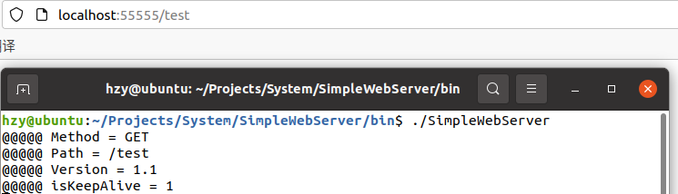  
### 2.4 抓包分析  
&emsp; &emsp; 以获取图片为例做简单的wireshark抓包分析(为了方便演示我把项目部署到了云服务器)  
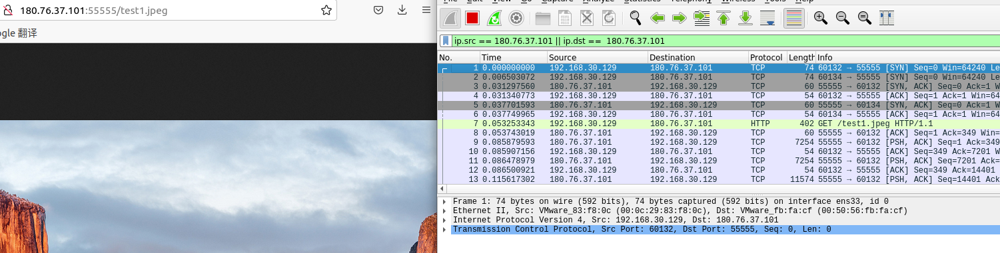  
&emsp; &emsp; 建立连接, 三次握手:  
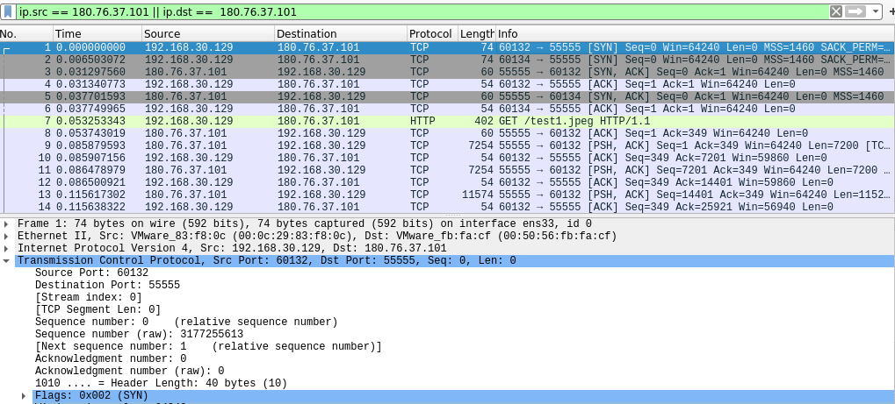  
&emsp; &emsp; 注意浏览器可能还会发送一个favicon.ico的请求,因此可能有两次连接建立.图中60132端口的请求才是我们的请求.ack number总是等于seq number+1,可以自己验证.  
&emsp; &emsp; 获取图片:  
  
&emsp; &emsp; ack number表示期望对方下一次传输的seq number.可以看到tcp无法判断数据流的边界,也就是说http报文可能会被切分成多份,也可能多个报文同时到达.我们在处理时必须考虑这些情况.  
&emsp; &emsp; 关闭连接, 四次分手:  
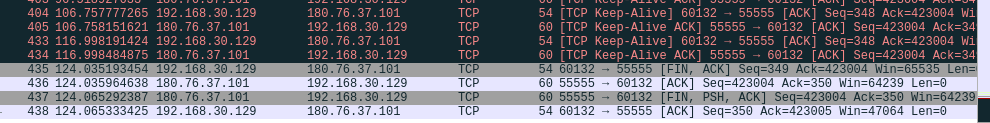  
&emsp; &emsp; 访问网页是长链接,因此会有tcp keep-alive.关闭网页后wireshark捕捉到四次分手过程.  
## 3 原理&实现  
&emsp; &emsp; 这一节我会结合原理描述webserver的完整流程,接着分享我的实现细节,包括项目结构,各模块功能,以及为什么这样设计等.另外,部分原理我会在实现中介绍,因为我认为有些原理要配合着实际设计来讲才能理解透彻.  
&emsp; &emsp;以获取一张图片为例,先看一下基本的流程:  
&emsp; &emsp;(1) C向S发起请求  
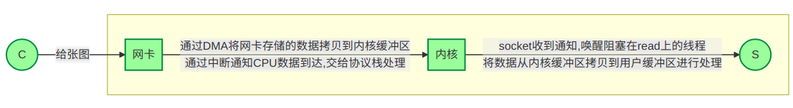
&emsp; &emsp;注:缓冲区分发送缓冲区和接收缓冲区,这里为了方便统称为缓冲区  
&emsp; &emsp;(2) S处理请求  
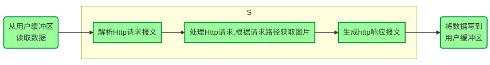
&emsp; &emsp;(3) S将图片发送给C  
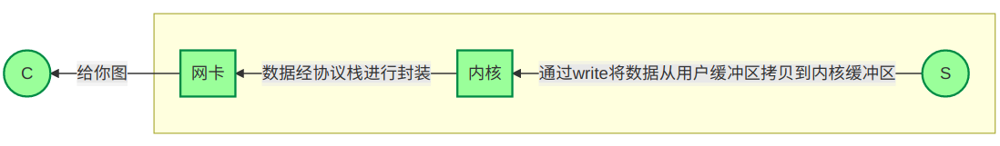
&emsp; &emsp;注: 数据从内核到网卡的具体流程我没有查到,是否是这样: 内核缓冲区中的数据通过DMA发送到网卡,网卡发送完数据后中断通知CPU可以继续发送数据?有了解的朋友可以在评论区指导一下.  
&emsp; &emsp; OK,现在我们了解了通信的大体流程,接下来看看并发量升高时会有什么问题:  
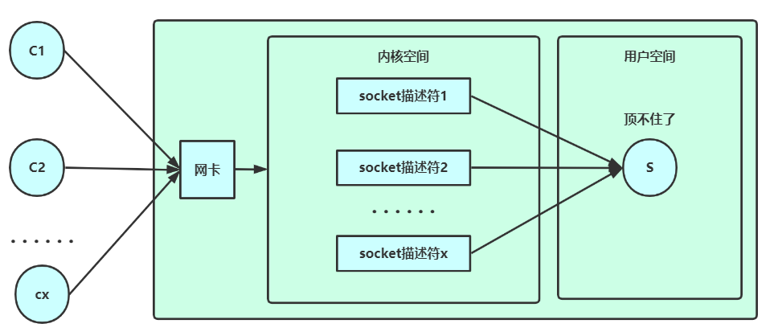  
&emsp; &emsp; 假设有10w个长连接,S要为每个sokcet描述符分配一个线程,总共10w个线程.每个线程都会占用一定的系统资源(最小8KB内核栈,本文不讨论协程).在并发量较高的场景下系统资源很容易被耗尽.  
&emsp; &emsp; 怎么办呢?我们可以雇一个管理员,由这个管理员告诉我们哪些socket描述符可读/可写.这样我们只需要维护一个管理员线程就好.而epoll就可以胜任这个管理员.epoll原理推荐看 [参考资料[7]](https://zhuanlan.zhihu.com/p/115220699) ,写得很好.  
&emsp; &emsp; 有了epoll后S就轻松多了:  
&emsp; &emsp; 接收请求报文:
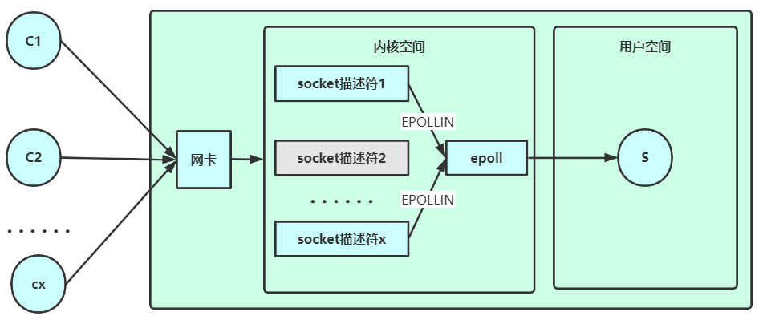  
&emsp; &emsp; 回复响应报文:  
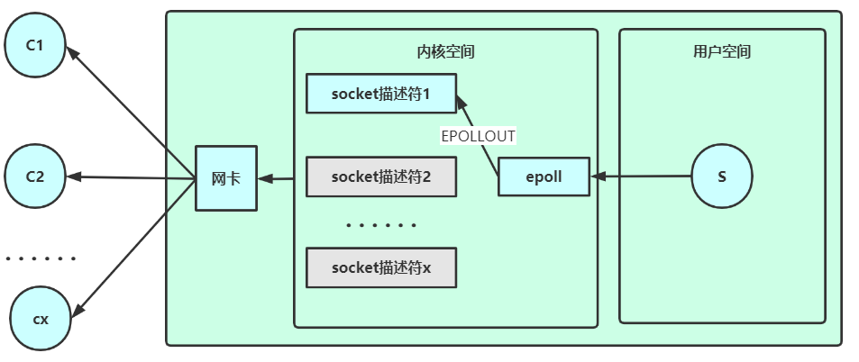  
&emsp; &emsp; 注意上文讨论的是长连接的情况,短连接时给每个socket描述符都分一个线程就好.  
&emsp; &emsp; 有了epoll,我们可以只用一个线程方便地把数据从内核缓冲区拷贝到用户缓冲区.然而,为提升处理效率,应充分发挥多核处理器的优势,进行并行处理.那就为每个请求创建一个处理线程...等一下,这样10w个请求不又会有10w个处理线程吗?这次我们限制线程的最大数目为处理器核心数,此时的线程只是做并行处理用的,而非收发数据.我们也很自然地想到用线程池去做这件事情.  
&emsp; &emsp; 其实线程池容量不一定要严格等于处理器核心数.可以设为核心数+2防止有线程意外宕掉.如果处理任务要和磁盘打交道的话可以设得更多(这样可以使得部分线程在cpu执行时,另一部分线程能够通过DMA与磁盘打交道,提高cpu利用率).这些都取决于实际场景.  
&emsp; &emsp; 讨论了这么多,我们的框架总算确定下来了.epoll负责收发数据,线程池负责处理数据.这个框架大家习惯叫半同步半异步,或者半同步半反应堆.半同步是指epoll,因为epoll本质上是阻塞的,属于同步IO(windows下的IOCP才是真正的异步IO).半异步/反应堆是指线程池,还是比较好理解的.  
&emsp; &emsp; 接下来开始实现.先来想一下我们要做哪些工作.既然是半同步半反应堆,那么得有个epoll模块和线程池模块.网卡和内核那块不归我们管,但内核空间和用户空间的数据交互需要我们实现,这就需要设计一个buffer模块.因为我们是用的http协议进行通信,要进行请求报文的解析和响应报文的制作,以及文件的读取,用户api的调用等操作,这些统一放在http模块中,在http模块里维护一个状态机去做这些事情.最后我们需要设计一个WebServer模块去统筹调度上述模块.  
&emsp; &emsp; 出于上述考虑,我的项目结构如下. 
```
  bin
  doc
  include
   |   transmission
   |   |   webserver
   |   |   |   Http.h
   |   |   |   WebServer.h
   |   utils
   |   |   buffer
   |   |   |   Buffer.h
   |   |   concurrence
   |   |   |   ThreadPool.h`
   |   |   nio
   |   |   |   Epoll.h
   |   |   Config.h
   |   |   Error.h
  src
  test
  tools
  www
```
&emsp; &emsp; 可以看到项目包含了上述的WebServer模块,Http模块,Epoll模块,Buffer模块和ThreadPool模块.Error模块做异常处理,Config模块做配置(暂未使用).  
&emsp; &emsp; 此外,bin目录存放可执行程序,doc目录存放文档(其实就是README用到的图片),include目录存放头文件,src目录存放源文件,test目录存放测试文件,tools目录存放一些工具,如代码行数统计,压力测试等.www目录存放网页用到的静态资源文件.  
&emsp; &emsp; (1) Epoll:  
&emsp; &emsp; 有关epoll的函数原型以及底层设计推荐看 [参考资料[8]](https://blog.csdn.net/baidu_41388533/article/details/110134366)  
&emsp; &emsp; 这个模块就是把epoll做了简单封装,方便调用.具体的应用我会在WebServer模块里做详细介绍.  
&emsp; &emsp; (2) 线程池:  
&emsp; &emsp; 有关线程池的设计细节推荐看 [参考资料[9]](https://www.cnblogs.com/lzpong/p/6397997.html)  
&emsp; &emsp; 基本原理是维护一个任务队列queue\<task\>和一个线程池vector\<thread\> .每个线程都是一个无限循环,当任务队列为空时wait,不为空时取一个任务执行.每添加一个新任务都会调用notify_one尝试唤醒一个线程.原理比较好理解,实现时发现大部分时间都在和C++11特性斗智斗勇,包括thread, mutex, condition_variable, atomic, functional以及lamda表达式.话说回来我在实现addTask函数时是想写个模板做完美转发的,但一直报错,无奈传个左值引用了事.  
&emsp; &emsp; (3) Buffer:  
&emsp; &emsp; 有关缓冲区的设计细节推荐看 [参考资料[10]](https://blog.csdn.net/daaikuaichuan/article/details/88814044)  
&emsp; &emsp; 这里参考muduo.拿vector做缓冲区.设置m_readPos和m_writePos两个指针,[0, m_readPos)的数据已从缓冲区读出,[m_readPos, m_writePos)的数据已写入缓冲区,还未读,[m_writePos, buffer size)这段空间是还能继续写入的空间.  
&emsp; &emsp; 当缓冲区没有足够的空间写入时需要扩容.这里要分两种情况,一种情况是写入的数据总量超过了buffer大小,这时直接对buffer做resize操作就好,resize操作不会影响已写入的数据.另一种情况是写入的数据总量没有超过buffer大小,这时将[m_readPos, m_writePos)这段数据拷贝到缓冲区开头,即[0, m_writePos-m_readPos),并更新m_writePos = m_writePos-m_readPos, m_readPos = 0.这样做是为了尽可能避免缓冲区频繁扩容,造成空间浪费.  
&emsp; &emsp; 另外,当缓冲区的数据被一次性全部读出时,设置m_readPos = m_writePos = 0,同样也是为了节省空间.  
&emsp; &emsp; muduo的缓冲区还规定了读写文件描述符的方式,这个我抽离到了Http模块里.因为写文件描述符时需要使用Http模块里的io向量,这个放到Buffer里总感觉有点奇怪.  
&emsp; &emsp; 注:以上三个模块比较简短,也比较好理解,就不帖代码了.  
&emsp; &emsp; (4) Http:  
&emsp; &emsp; 重头戏来了.首先我推荐 [参考资料[4]](https://mp.weixin.qq.com/s/BfnNl-3jc_x5WPrWEJGdzQ) [参考资料[5]](https://mp.weixin.qq.com/s/wAQHU-QZiRt1VACMZZjNlw) [参考资料[6]](https://mp.weixin.qq.com/s/451xNaSFHxcxfKlPBV3OCg) ,我在编写项目的过程中也是反复阅读这三篇资料中的源码,状态图. 这里我尽量给大家理清楚.  
&emsp; &emsp; 我们把上面的图拿下来,事情要从这张图说起.  
  
&emsp; &emsp; 首先是从输入缓冲区读请求,然后处理请求,再写到输出缓冲区...等一下,我们为什么需要缓冲区?来一条请求处理一条不好吗?还记得上面的抓包结果吗?一条http报文可能会被分为若干tcp分组发送,而tcp无法判断数据流边界,也就是说EPOLLIN来的数据可能有好几条请求连在一起,甚至可能只有一半请求.这一半请求你就没法处理了吧,是不是要找个地方暂存一下?缓冲区的一个重要作用就是帮你暂存这些不完整的请求.另外,当有多条请求连在一起时,我们一般一次EPOLLIN只处理一条,剩下的留在缓冲区里下次再处理,这样主要是为了方便编程,我会在WebServer模块继续讨论这个问题,保证缓冲区的请求都能得到处理.  
&emsp; &emsp; OK,那现在就先把读写缓冲区的函数写了吧...再等一下,这个地方有人好像说过LT模式和ET模式什么的,什么一次EPOLLIN/EPOLLOUT不循环读/写就会出错.这个问题我们会在WebServer模块做处理,减轻Http模块的负担.这里只需要向外面提供一个读一次请求/写一次请求的函数就好(读者可能要骂了:你这不在Buffer模块里读描述符,非放在Http模块里,现在又把ET什么的放在WebServer模块里...当然这也只是我自己设计方式,主要是想把每件事情交给合适的模块去做,大家按照自己喜欢的方式实现就好了.接受吐槽).   
&emsp; &emsp; 终于可以读写缓冲区了,这里有必要贴一下代码:  
```c++
    // 从readBuffer中读取请求
    // ET模式下WebServer会循环调用这个函数
    ssize_t Http::readRequest(int fd, int *ern) {
        char buffer[65536]; // 内核缓冲区比readBuffer剩余空间大时先存到这里,然后再对buffer进行扩容
        struct iovec iov[2];
        size_t wtb = m_readBuffer.writableBytes();
        iov[0].iov_base = m_readBuffer.nextWritePos();
        iov[0].iov_len = wtb;
        iov[1].iov_base = buffer;
        iov[1].iov_len = sizeof(buffer);
        ssize_t len = readv(fd, iov, 2); // 等于0貌似是对端关闭连接来着,在WebServer里也要断开连接
        if (len < 0) {
            *ern = errno;
        } else if (len > 0) {
            // 这里有的直接改buffer,有的只改下标,不太好看,不过为了效率就这么写吧...
            if (static_cast<size_t>(len) <= wtb) {
                m_readBuffer.writeBuffer_idx(static_cast<size_t>(len));
            } else {
                m_readBuffer.writeBuffer_idx(static_cast<size_t>(wtb));
                m_readBuffer.writeBuffer(buffer, len-wtb);
            }
            if (m_debug) {
                std::cout << "[fd:" << m_fd << "] ";
                m_readBuffer.output();
            }
        }
        return len;
    }

    // 将响应报文写入writeBuffer
    // ET模式下WebServer会循环调用这个函数
    ssize_t Http::writeResponse(int fd, int *ern) {
        ssize_t len = writev(fd, m_iov, m_iovCnt); // 这个等于0没什么影响,一般就是内核缓冲区写不进去了
        if (len < 0) {
            *ern = errno;
        }
        else if (len > 0) {
            if (static_cast<size_t>(len) > m_iov[0].iov_len) {
                m_iov[1].iov_base = (char*)m_iov[1].iov_base+(len-m_iov[0].iov_len);
                m_iov[1].iov_len -= (len - m_iov[0].iov_len);
                if (m_iov[0].iov_len != 0) {
                    m_writeBuffer.readBufferAll_idx(); // 相当于清空writeBuffer
                    m_iov[0].iov_len = 0;
                }
            } else {
                m_iov[0].iov_base = (char*)m_iov[0].iov_base+len;
                m_iov[0].iov_len -= len;
                m_writeBuffer.readBuffer_idx(len);
            }
        }
        return len;
    }
```
&emsp; &emsp; 可以看到我在读写时都用到了io向量,也就是readv和writev函数,io向量可以帮助我们在一次系统调用内实现整个向量的读/写,否则的话要为向量中的每个元素做一次系统调用,影响效率.  
&emsp; &emsp; 读的时候我另外开了一个大小为65536的栈空间(其实也是参考了moduo的设计),如果读取的内容超出m_readBuffer的大小会将数据暂存在这个栈空间中,然后给m_readBuffer扩容,再将栈空间的数据写入m_readBuffer,从而实现每次多读取一些数据,减小系统调用的次数.  
&emsp; &emsp; 写的时候我也用到了包含两个元素的io向量.这两个元素其实存储着响应报文,分别表示响应报文的(状态行+头部)以及(响应内容).  
&emsp; &emsp; 另外可以这个地方要注意缓冲区下标的变化,我刚开始的时候把下标搞错了导致测试时请求全脏了.  
&emsp; &emsp; 完成了请求/响应的读/写,下面就来解析请求报文->处理请求->生成响应报文.  
&emsp; &emsp; 首先了解一下http的报文结构:  
&emsp; &emsp; HTTP请求报文由请求行(request line)、请求头部(header)、空行和请求数据四个部分组成.其中,请求分为两种,GET和POST,具体的:  
```
请求行，用来说明请求类型,要访问的资源以及所使用的HTTP版本。
GET说明请求类型为GET，/562f25980001b1b106000338.jpg(URL)为要访问的资源，该行的最后一部分说明使用的是HTTP1.1版本。
请求头部，紧接着请求行（即第一行）之后的部分，用来说明服务器要使用的附加信息。
HOST，给出请求资源所在服务器的域名。
User-Agent，HTTP客户端程序的信息，该信息由你发出请求使用的浏览器来定义,并且在每个请求中自动发送等。
Accept，说明用户代理可处理的媒体类型。
Accept-Encoding，说明用户代理支持的内容编码。
Accept-Language，说明用户代理能够处理的自然语言集。
Content-Type，说明实现主体的媒体类型。
Content-Length，说明实现主体的大小。
Connection，连接管理，可以是Keep-Alive或close。
空行，请求头部后面的空行是必须的即使第四部分的请求数据为空，也必须有空行。
请求数据也叫主体，可以添加任意的其他数据。

GET /562f25980001b1b106000338.jpg HTTP/1.1
Host:img.mukewang.com
User-Agent:Mozilla/5.0 (Windows NT 10.0; WOW64)
AppleWebKit/537.36 (KHTML, like Gecko) Chrome/51.0.2704.106 Safari/537.36
Accept:image/webp,image/*,*/*;q=0.8
Referer:http://www.imooc.com/
Accept-Encoding:gzip, deflate, sdch
Accept-Language:zh-CN,zh;q=0.8
空行
请求数据为空请求数据为空

POST / HTTP1.1
Host:www.wrox.com
User-Agent:Mozilla/4.0 (compatible; MSIE 6.0; Windows NT 5.1; SV1; .NET CLR 2.0.50727; .NET CLR 3.0.04506.648; .NET CLR 3.5.21022)
Content-Type:application/x-www-form-urlencoded
Content-Length:40
Connection: Keep-Alive
空行
name=Professional%20Ajax&publisher=Wiley
```
&emsp; &emsp; HTTP响应也由四个部分组成,分别是:状态行,消息报头,空行和响应正文.具体的:  
```
状态行，由HTTP协议版本号， 状态码， 状态消息 三部分组成。
第一行为状态行，（HTTP/1.1）表明HTTP版本为1.1版本，状态码为200，状态消息为OK。
消息报头，用来说明客户端要使用的一些附加信息。
第二行和第三行为消息报头，Date:生成响应的日期和时间；Content-Type:指定了MIME类型的HTML(text/html),编码类型是UTF-8。
空行，消息报头后面的空行是必须的。
响应正文，服务器返回给客户端的文本信息。空行后面的html部分为响应正文。

HTTP/1.1 200 OK
Date: Fri, 22 May 2009 06:07:21 GMT
Content-Type: text/html; charset=UTF-8
空行
<html>
      <head></head>
      <body>
            <!--body goes here-->
      </body>
</html>
```
&emsp; &emsp; http报文中的每行数据都以\r\n结尾,易于提取.但要注意content中的数据是不以\r\n结尾的,需要配合header中的Content-Length字段进行读取.  
&emsp; &emsp; 除此之外, HTTP有5种类型的状态码，具体的：
```
1xx：指示信息--表示请求已接收，继续处理。
2xx：成功--表示请求正常处理完毕。
    200 OK：客户端请求被正常处理。
    206 Partial content：客户端进行了范围请求。
3xx：重定向--要完成请求必须进行更进一步的操作。
    301 Moved Permanently：永久重定向，该资源已被永久移动到新位置，将来任何对该资源的访问都要使用本响应返回的若干个URI之一。
    302 Found：临时重定向，请求的资源现在临时从不同的URI中获得。
4xx：客户端错误--请求有语法错误，服务器无法处理请求。
    400 Bad Request：请求报文存在语法错误。
    403 Forbidden：请求被服务器拒绝。
    404 Not Found：请求不存在，服务器上找不到请求的资源。
5xx：服务器端错误--服务器处理请求出错。
    500 Internal Server Error：服务器在执行请求时出现错误。
```
&emsp; &emsp; 正如之前说的,m_readBuffer中的http请求可能不完整,也可能有若干条,解析起来比较困难.这里用一个状态机去做这件事情.可以简单的理解为一个while循环,每次处理请求中的一行数据(我还没有做content的解析).循环里面用一个switch判断当前的状态,并交给相应的方法去处理.从而从m_readBuffer中解析出一条请求.之后状态机会执行请求,并制作响应报文,存储在m_writeBuffer中.我们会在WebServer模块保证每个状态机只有在发送完一条响应后才能继续解析下一条请求,避免一些意外的错误.状体机是Http模块的核心,整个模块都会围绕这个状态机运转.其结构框图如下:  
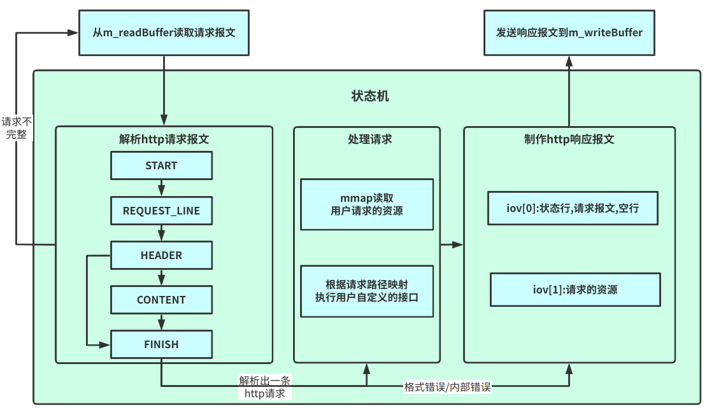  
&emsp; &emsp; 下面结合代码解释每个部分的作用.
```c++
    // 处理用户的请求(调用api或读取文件)
    // true表示之后可以发送响应报文了(有错误的话code会相应地设为BAD_REQUEST,INTERNAL_ERROR等),false表示数据不完整,还需要继续等待数据到来
    // userFunction是用户自定义的api
    bool Http::process(std::unordered_map<std::string, std::function<void(Http*)>> *userFunction) {
        // 注意缓冲区里的请求可能不完整,也可能有多条请求,这些都要考虑在内
        // 请求不完整时return false继续等数据就好,维护好状态机的全局状态
        // 多条请求时要在response发完后重新调用process,形成一个环路
        while (true) {
            if (m_state == START) {
                if (!readLine()) {
                    return false;
                }
                m_state = REQUEST_LINE;
            } else if (m_state == REQUEST_LINE) {
                if (!parseRequestLine()) {
                    m_code = BAD_REQUEST;
                    break;
                }
                m_state = HEADER;
                if (!readLine()) {
                    return false;
                }
            } else if (m_state == HEADER) {
                if (m_line.empty()) { // header后一定有个空行,接着根据是否有content进行状态转移
                    if (getContentLength() == 0) {
                        m_state = FINISH;
                    } else {
                        m_state = CONTENT;
                        if (!readLine()) {
                            return false;
                        }
                    }
                    continue;
                }
                if (!parseHeader()) {
                    m_code = BAD_REQUEST;
                    break;
                }
                if (!readLine()) {
                    return false;
                }
            } else if (m_state == CONTENT) {
                // todo
                utils::Error::Throw(utils::Error::SORRY);
            } else if (m_state == FINISH) {
                if (m_debug) {
                    std::cout << "[fd:" << m_fd << "] " << "finished" << std::endl;
                }
                break;
            } else {
                m_code = INTERNAL_ERROR;
                break;
            }
        }
        if (m_code == OK) {
            execute(userFunction); // 处理请求
        }
        // 制作响应报文
        addStateLine();
        addHeader();
        addContent();
        return true;
    }
```
&emsp; &emsp; 首先是状态机主体.考虑到content不以\r\n结尾,我没有选择在每次循环开始时调用readLine读取m_readBuffer中的一行数据,而是在每个状态处理完毕后判断是否需要继续readLine.接着依据当前的状态(START, REQUEST_LINE, HEADER, CONTENT, FINISH)调用相应的函数(parseRequestLine,parseHeader以及parseContent),并进行状态转移.HEADER转移时要注意判断Content-Length是否为0(不存在的话也视为0),等于0的话就没必要去解析content了.解析过程中如果readLine返回false则说明请求不完整,状态机向上层返回false表示继续等待数据到达.一次解析过程中状态m_state是持久化的,就是说如果当前解析到了HEADER,发现请求不完整返回false,那么下一次数据到达时状态机依然从HEADER状态进行解析.解析出一条报文后,若未出现请求格式错误或内部错误则调用execute执行请求(参数userFunction保存了请求路径到用户接口的映射,比如用户写了个helloworld函数,关联到了地址/hello上,那么userFunction这个map中就会保存一条<"/hello", helloworld()>),若出现了错误我采取的措施是生成响应报文告诉用户请求出错,随后断开连接释放所有资源.最后,状态机会依次调用addStateLine,addHeader,addContent制作请求报文保存到m_writeBuffer中,整个Http模块就完成了一次任务.  
&emsp; &emsp; 上述过程涉及到了readLine,parseRequestLine,parseHeader以及parseContent,execute,addStateLine,addHeader,addContent等函数,其中readLine本质上是个字符串查询,parse*系列本质上就是一行正则表达式提取匹配字段,add*系列本质上就是做了一下字符串的拼接,这里就不详细介绍了,大家可以自行阅读源码.execute里用了mmap,这里需要介绍一下:  
```c++
    // 其实用户api从WebServer那里传参过来也不怎么优雅...
    void Http::execute(std::unordered_map<std::string, std::function<void(Http*)>> *userFunction) {
        if (userFunction->count(m_path) == 1) {
            // 根据路径调用用户api
            if (m_debug) {
                std::cout << "[fd:" << m_fd << "] " << "call user function" << std::endl;
            }
            auto func = (*userFunction)[m_path];
            func(this);
        } else {
            // 使用mmap将文件映射到m_file
            if (m_debug) {
                std::cout << "[fd:" << m_fd << "] " << "read file" << std::endl;
            }
            std::string path = "../www"+m_path; // 我是默认在bin下面运行的,这个路径可以自己改一下
            if (stat(path.c_str(), &m_fileStat) < 0 || S_ISDIR(m_fileStat.st_mode)) {
                if (m_debug) {
                    std::cout << "[fd:" << m_fd << "] " << "not found1" << std::endl;
                }
                m_code = NOT_FOUND;
                return;
            }
            if (!(m_fileStat.st_mode & S_IROTH)) { // 权限判断
                if (m_debug) {
                    std::cout << "[fd:" << m_fd << "] " << "forbidden" << std::endl;
                }
                m_code = FORBIDDEN;
                return;
            }
            int fd = open(path.c_str(), O_RDONLY);
            if (fd < 0) {
                if (m_debug) {
                    std::cout << "[fd:" << m_fd << "] " << "not found2" << std::endl;
                }
                m_code = NOT_FOUND;
                return;
            }
            int* ret = (int*) mmap(nullptr, m_fileStat.st_size, PROT_READ, MAP_PRIVATE, fd, 0);
            if (*ret == -1) {
                if (m_debug) {
                    std::cout << "[fd:" << m_fd << "] " << "not found3" << std::endl;
                }
                m_code = NOT_FOUND;
                return;
            }
            m_file = (char*)ret;
            close(fd);
            if (m_debug) {
                std::cout << "[fd:" << m_fd << "] " << "read successfully" << std::endl;
            }
        }
    }
```
&emsp; &emsp; 首先execute会判断当前请求路径是否关联了用户接口,是的话调用用户接口.否则根据请求路径读取文件.若文件存在,且有访问权限,则使用mmap读取文件到m_file中.mmap使得磁盘到用户内存只需要一次拷贝(正常需要磁盘到页缓存再到用户内存两次拷贝).原理如下(截自 [参考资料11](https://www.cnblogs.com/huxiao-tee/p/4660352.html) ):  
&emsp; &emsp; mmap是一种内存映射文件的方法，即将一个文件或者其它对象映射到进程的地址空间，实现文件磁盘地址和进程虚拟地址空间中一段虚拟地址的一一对映关系。实现这样的映射关系后，进程就可以采用指针的方式读写操作这一段内存，而系统会自动回写脏页面到对应的文件磁盘上，即完成了对文件的操作而不必再调用read,write等系统调用函数。相反，内核空间对这段区域的修改也直接反映用户空间，从而可以实现不同进程间的文件共享  
&emsp; &emsp; 常规文件操作为了提高读写效率和保护磁盘，使用了页缓存机制。这样造成读文件时需要先将文件页从磁盘拷贝到页缓存中，由于页缓存处在内核空间，不能被用户进程直接寻址，所以还需要将页缓存中数据页再次拷贝到内存对应的用户空间中。这样，通过了两次数据拷贝过程，才能完成进程对文件内容的获取任务。写操作也是一样，待写入的buffer在内核空间不能直接访问，必须要先拷贝至内核空间对应的主存，再写回磁盘中（延迟写回），也是需要两次数据拷贝。  
&emsp; &emsp; 而使用mmap操作文件中，创建新的虚拟内存区域和建立文件磁盘地址和虚拟内存区域映射这两步，没有任何文件拷贝操作。而之后访问数据时发现内存中并无数据而发起的缺页异常过程，可以通过已经建立好的映射关系，只使用一次数据拷贝，就从磁盘中将数据传入内存的用户空间中，供进程使用。  
&emsp; &emsp; 总算把Http模块写完了! 回顾一下,我们了解了http报文结构,状态码的定义;用io向量读写缓冲区;用状态机从m_readBuffer中解析请求报文,处理请求(根据请求路径调用用户接口或用mmap读取请求文件),并生成响应报文到m_writeBuffer中.不过仔细想想整个项目还没运转起来,线程池呢?Epoll呢?Http模块缓冲区的读写函数该怎么调用?状态机该怎么调用?如何做并发控制?最后的统筹调度工作我们交给WebServer模块去做.  
&emsp; &emsp; (5) WebServer模块  
&emsp; &emsp; 先把上面的图拿下来,围绕这两张图以及WebServer的主体代码讨论WebServer模块应该做什么.
  
  
```c++
    void WebServer::start() {
        // 由于设置了oneshot每个fd只会被一个线程处理,因此每个事件内部是无数据竞争的
        // 但不同事件间可能有数据竞争,这个在delUser里作了处理(分析一下会发现就delUser会有问题,其余函数都是线程安全的)
        while (!isClosed) {
            if (m_debug) {
                std::cout << "========================================" << std::endl;
            }
            // blocking
            int eventCnt = m_epoll.wait(-1);
            // process events
            for (int i = 0; i < eventCnt; i++) {
                int fd = m_epoll.getFd(i);
                uint32_t events = m_epoll.getEvent(i);
                if (fd == m_fd) {
                    addUser();
                } else if (events & (EPOLLRDHUP|EPOLLHUP|EPOLLERR)) {
                    delUser(fd);
                } else if (events & EPOLLIN) {
                    processRead(fd);
                } else if (events & EPOLLOUT) {
                    processWrite(fd);
                } else {
                    utils::Error::Throw(utils::Error::EPOLL_UNEXPECTED_ERROR);
                }
            }
        }
    }
```
&emsp; &emsp; 可以看到WebServer的主体代码本质上也是个状态机.没事的时候epoll会阻塞在wait上.若当前事件的描述符与epoll的描述符相同,则说明要建立新的连接,WebServer会调用addUser去accept这个连接,在epoll中为accept到的描述符注册一个新事件,并创建一个Http对象负责处理这个连接的请求. EPOLLIN事件到来时WebServer会调用processRead将内核缓冲区的请求报文拷贝到相关Http对象的读缓冲区,处理请求,这个过程会创建一个任务,交给线程池去执行.EPOLLOUT事件到来时表示内核缓冲区可写,WebServer会调用processWrite将相关Http对象写缓冲区的响应报文写入内核缓冲区,这个过程同样也会创建一个任务,交给线程池去处理.EPOLLRDHUP|EPOLLHUP|EPOLLERR表示对端关闭或者出错,此时调用delUser关闭连接,在epoll中删除相应的事件,并删除对应的Http对象.  
&emsp; &emsp; addUser,delUser,processRead,processWrite等函数的实现如下:  
&emsp; &emsp; (1) processRead & processWrite:
```c++
    void WebServer::processRead(int fd) {
        assert(m_users.count(fd) > 0);
        Http* user = m_users[fd];
        assert(user != nullptr);
        if (m_debug) {
            std::cout << "epoll in" << std::endl;
        }
        m_threadPool.addTask([this, fd, user] {
            // read request
            while (true) {
                int ern = 0;
                ssize_t ret = user->readRequest(fd, &ern);
                if (ret < 0) {
                    if (ern == EAGAIN || ern == EWOULDBLOCK) {
                        break;
                    }
                    if (m_debug) {
                        std::cout << "processRead:ret < 0:delete user" << std::endl;
                    }
                    delUser(fd);
                    return;
                } else if (ret == 0) {
                    if (m_debug) {
                        std::cout << "processRead:ret == 0:delete user" << std::endl;
                    }
                    delUser(fd);
                    return;
                }
            }
            // 处理请求
            if (user->process(&userFunction)) {
                // 注意由于设置了oneshot这里要更新一下才能继续使用这个fd
                m_epoll.modFd(fd, m_userEvent | EPOLLOUT);
            } else {
                // 请求不完整,继续等待数据
                m_epoll.modFd(fd, m_userEvent | EPOLLIN);
            }
        });
    }

    void WebServer::processWrite(int fd) {
        assert(m_users.count(fd) > 0);
        Http* user = m_users[fd];
        assert(user != nullptr);
        if (m_debug) {
            std::cout << "epoll out" << std::endl;
        }
        m_threadPool.addTask([this, fd, user] {
            while (true) {
                int ern = 0;
                ssize_t ret = user->writeResponse(fd, &ern);
                if (ret < 0) {
                    if (ern == EAGAIN || ern == EWOULDBLOCK) {
                        break;
                    }
                    if (m_debug) {
                        std::cout << "processWrite:ret < 0:delete user" << std::endl;
                    }
                    delUser(fd);
                } else if (ret == 0) {
                    break;
                }
            }
            if (user->toWriteBytes() == 0) {
                // buffer dirty
                if (user->hasError()) {
                    if (m_debug) {
                        std::cout << "processWrite:has error:delete user" << std::endl;
                    }
                    delUser(fd);
                    return;
                }
                // 短连接时server会在发送完响应报文后关闭连接
                if (!user->isKeepAlive()) {
                    if (m_debug) {
                        std::cout << "processWrite:keep alive:delete user" << std::endl;
                    }
                    delUser(fd);
                    return;
                }
                // 如process中描述的那样, 多条请求时要在response发完后重新调用process,形成一个环路
                user->initNextHttp();
                if (user->process(&userFunction)) {
                    m_epoll.modFd(fd, m_userEvent | EPOLLOUT);
                } else {
                    m_epoll.modFd(fd, m_userEvent | EPOLLIN);
                }
            } else {
                m_epoll.modFd(fd, m_userEvent | EPOLLOUT);
            }
        });
    }
```
&emsp; &emsp; 这里涉及到了与Http模块缓冲区的交互,也是之前遗留下来的一个问题.我们先来了解一下LT(水平触发)模式和ET(边缘触发)模式.LT模式下只要内核缓冲区不为空/不满就持续触发EPOLLIN/EPOLLOUT去通知用户读取/写入,而ET模式下只有缓冲区从空到非空/从满到非满时才会触发一次EPOLLIN/EPOLLOUT去通知用户读取/写入.换言之,LT模式下一次EPOLLIN/EPOLLOUT可以只进行一次read/wirte,这次没有读/写完的话epoll还会继续通知.但在ET模式下不能这样做.假设客户只发了一条请求,服务器完整接受并保存在了内核缓冲区.由于用户缓冲区大小的限制,只有一半请求从内核拷贝到了用户.在这个场景下客户后续不再发送请求,不会再触发EPOLLIN,也就是说另一半请求会一直留在内核缓冲区中读不出来.ET模式需要我们在一次EPOLLIN时循环读取内核数据,直到errorno == EAGAIN, 表示内核缓冲区中已无数据(写的时候一般没什么问题,不过为了效率也采用循环写比较好).另外,ET模式通常是比LT模式高效的,我项目也是采用了ET模式.  
&emsp; &emsp; 还有一个很重要的问题,由于此处涉及到了并发,需警惕并发漏洞.庆幸的是,epoll的EPOLLONESHOT选项帮助我们简化了这个问题.设置EPOLLONESHOT后一个事件只会被触发一次,也就是说它触发后只能被一个线程处理(不设置EPOLLONESHOT的话可能会有多个线程同时修改一个Http对象).这样可以保证一个事件不会和自己产生数据竞争.注意要在线程处理结束后重新设置这个事件,不然会影响后续的正常使用.  
&emsp; &emsp; 另外,在processWrite中还有一些关键设置.一是在发送完响应报文后立即初始化并执行状态机.这样是为了处理上面提到的m_readBuffer中有多条请求的情况.现在整个过程形成了一个闭环,保证所有请求都能得到处理.二是我特别处理了一下请求出错的情况,在发送完响应报文后会关闭连接,保护服务器.关于发送完报文再关闭连接这个操作可以去设置socket的linger,里面可以选择正常FIN,RST或是定时FIN+RST,我用了定时(1s)FIN+RST,毕竟关闭连接时也不想让服务器等太长时间.  
&emsp; &emsp; (2) addUser & delUser:
```c++
    void WebServer::addUser() {
        struct sockaddr_in address = {};
        socklen_t len = sizeof(address);
        while (true) {
            int fd = accept(m_fd, (struct sockaddr*)&address, &len);
            // 举个例子,fd=4被close以后下次accept的fd可能还是4,也就是说一个序号会被重复利用
            // 因此我没有delete掉Http,而是每次重新初始化,这样空间会耗费一些,但就不用每次都new了,会快一点
            if (fd < 0 || m_userCnt >= MAX_USER) {
                return;
            }
            setNonBlocking(fd);
            if (m_users.count(fd) == 0) {
                m_users[fd] = new Http(fd, m_debug);
            } else {
                Http* user = m_users[fd];
                user->clearBuffer();
                user->initNextHttp();
            }
            m_userCnt++;
            m_epoll.addFd(fd, m_userEvent | EPOLLIN);
            if (m_debug) {
                std::cout << "add user, fd = " << fd << std::endl;
                std::cout << "userCnt = " << m_userCnt << std::endl;
            }
        }
    }

     void WebServer::delUser(int fd) {
        assert(m_users.count(fd) > 0);
        assert(m_users[fd] != nullptr);
        // 由于多个任务可能并发调用delUser,这里会发生数据竞争,所以用了原子变量
        m_userCnt--;
        m_epoll.delFd(fd);
        close(fd);
        if (m_debug) {
            std::cout << "delete user, fd = " << fd << std::endl;
            std::cout << "userCnt = " << m_userCnt << std::endl;
        }
    }
``` 
&emsp; &emsp; epoll需要为套接字设置非阻塞模式,addUser中的while(true) accept就是最好的例子.观察一下会发现这个死循环只有当accept接受不到新连接时才会跳出,而在阻塞模式下accept接受不到新连接的话会阻塞,会永远卡死在这个地方.同理ET模式的while循环中也会有这个问题.所以我们把所有套接字都设置成了非阻塞模式.  
&emsp; &emsp; 另外,被释放的套接字编号是可以再次被accept利用的,这时我并没有重新new一个Http对象,而是选择了直接初始化(清空缓冲区+初始化状机).  
&emsp; &emsp; addUser, delUser中的m_userCnt可能会被多个线程同时更新,因此要使用原子变量避免数据竞争.由于我们并没有去delete Http对象,因此无需担心m_users的数据竞争.epoll自身是线程安全的,也不需要我们担心.  
&emsp; &emsp; 至此,项目构建完毕,大功告成!  
&emsp; &emsp; // todo:后面抽时间加个流程总结,最近实在有点忙.
## 4 压测&对比  
&emsp; &emsp; 这一节我会用webbence1.5对本文的WebServer(SimpleWebServer), [参考资料[2]](https://github.com/markparticle/WebServer) 的WebServer(先叫它MPWebServer吧)以及gin做压测对比,向它们请求同一张图片(40KB).环境是deepin20+AMD R7 4800U+16GB,SimpleWebServer和MPWebServer均开启O3优化.因为没有合适的设备,压测程序和WebServer都放在了本机上.创建100个连接压测5秒  
&emsp; &emsp; (1) SimpleWebserver,11400QPS:  
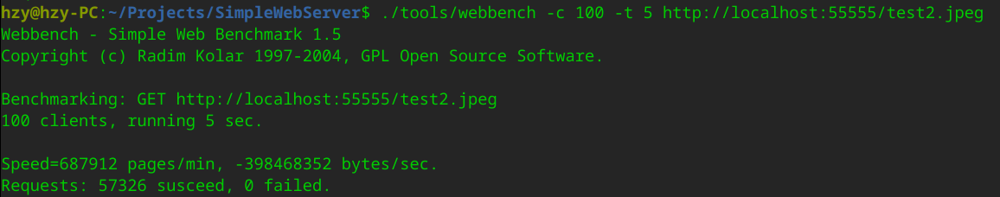  
&emsp; &emsp; (2) MPWebserver,10400QPS:  
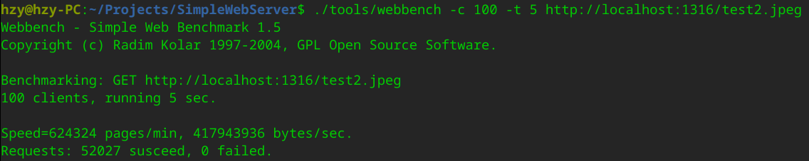  
&emsp; &emsp; (3) gin,21100QPS:  
  
&emsp; &emsp; 差不多是我的两倍w(ﾟДﾟ)w,不清楚是不是协程带来的优化,总之后面还会研究一下.  
&emsp; &emsp; 另外我的1核2GB 1Mb带宽的服务器只有10QPS...带宽太难搞了.  
## 5 参考资料  
[1] https://github.com/qinguoyi/TinyWebServer  
[2] https://github.com/markparticle/WebServer  
[3] Linux高性能服务器编程，游双著  
[4] http连接处理(上): https://mp.weixin.qq.com/s/BfnNl-3jc_x5WPrWEJGdzQ  
[5] http连接处理(中): https://mp.weixin.qq.com/s/wAQHU-QZiRt1VACMZZjNlw  
[6] http连接处理(下): https://mp.weixin.qq.com/s/451xNaSFHxcxfKlPBV3OCg  
[7] IO多路复用: https://zhuanlan.zhihu.com/p/115220699  
[8] Epoll: https://blog.csdn.net/baidu_41388533/article/details/110134366  
[9] 线程池: https://www.cnblogs.com/lzpong/p/6397997.html  
[10] buffer设计: https://blog.csdn.net/daaikuaichuan/article/details/88814044  
[11] mmap:https://www.cnblogs.com/huxiao-tee/p/4660352.html