# 简易webserver的设计与实现  
&emsp; &emsp; 最近学习IO多路复用的过程中尝试写了一个webserver, 使用Epoll多路复用(边沿触发)+线程池技术, 实现了半同步半反应堆模型. 通过状态机解析http/1.1 GET请求, 可根据请求路径调用自定义接口.这里记录一下设计与实现的过程.    
&emsp; &emsp; [项目地址](https://github.com/Zongyin-Hao/SimpleWebServer)  
## 1 编译&运行  
&emsp; &emsp; github上的项目是编译好的,二进制文件在bin目录下,运行时cd到bin目录执行./SimpleWebServer即可(注意由于路径问题一定要在bin目录下运行).默认端口55555.  
```
  cd bin
  ./SimpleWebServer
```
&emsp; &emsp; 如果想自己编译的话可以将项目导入clion进行编译(导入前删掉.idea, 使用release模式).或者在项目目录下新建个build文件夹,cd进去使用cmake -DCMAKE_BUILD_TYPE=Release ..以及make进行编译(编译后的二进制文件在bin目录下).  
```
  mkdir build
  cd build
  cmake -DCMAKE_BUILD_TYPE=Release ..
  make
```
&emsp; &emsp; 如果想自定义端口,自定义api的话需要去src/main.cpp里进行修改,然后重新编译:
```c++
#include <iostream>
#include "transmission/webserver/WebServer.h"
using std::cout;
using std::endl;

int main() {
    transmission::webserver::WebServer webServer(55555, 16, false);
    ...
    return 0;
}
```
## 2 功能展示  
### 2.1 获取图片  
  
&emsp; &emsp; 可以重复多次测试,以检测请求处理的正确性  

### 2.2 文件下载  
  
&emsp; &emsp; 下载好的视频是可以正常播放的,可自行测试.  
### 2.3 API调用  
&emsp; &emsp; 支持根据请求路径调用用户自定义的API.  
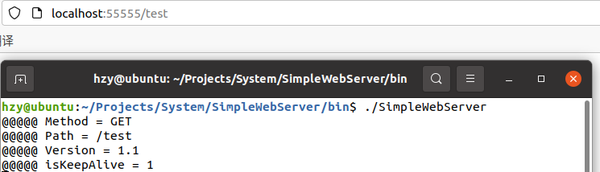  
### 2.4 抓包分析  
&emsp; &emsp; 以获取图片为例做简单的wireshark抓包分析(为了方便演示我把项目部署到了云服务器)  
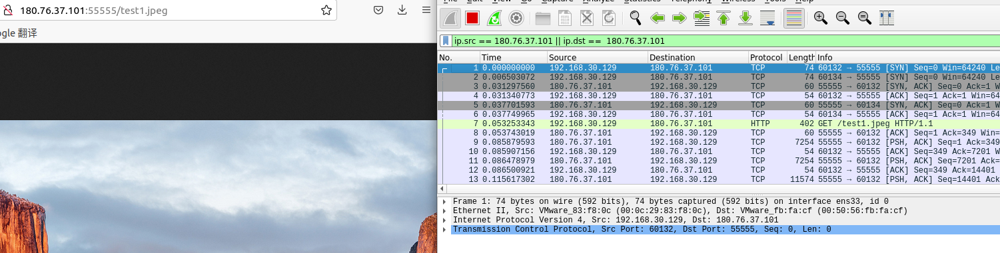  
&emsp; &emsp; 建立连接, 三次握手:  
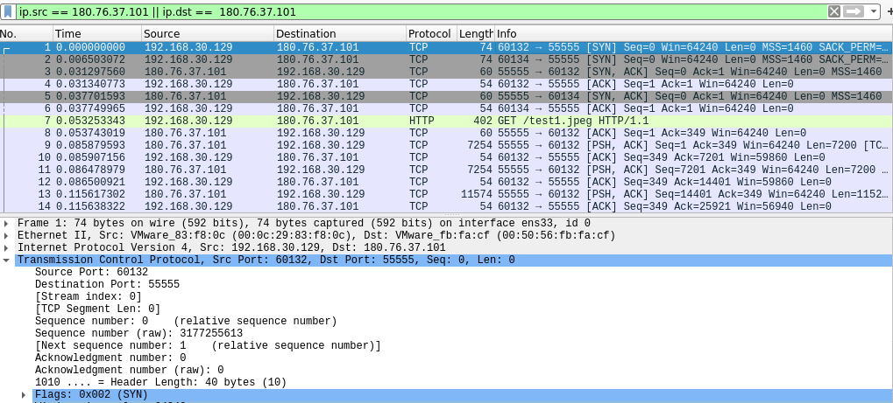  
&emsp; &emsp; 注意浏览器可能还会发送一个favicon.ico的请求,因此可能有两次连接建立.图中60132端口的请求才是我们的请求.
&emsp; &emsp; 获取图片:  
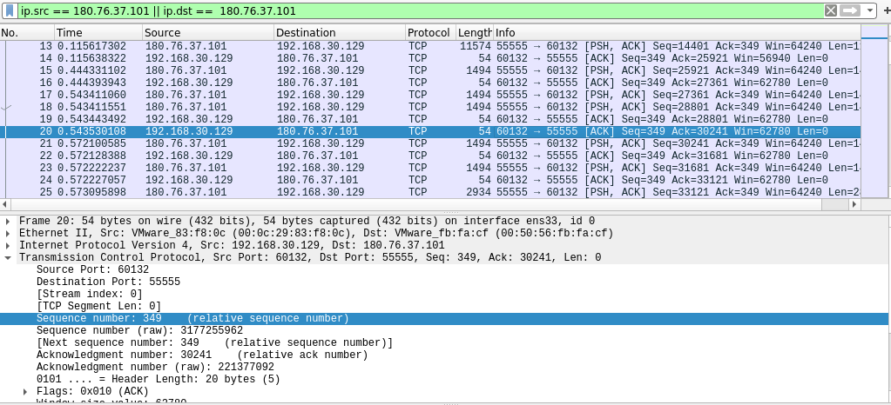  
&emsp; &emsp; ack number表示期望对方下一次传输的seq number.可以看到tcp无法判断数据流的边界,也就是说http报文可能会被切分成多份.
&emsp; &emsp; 关闭连接, 四次分手:  
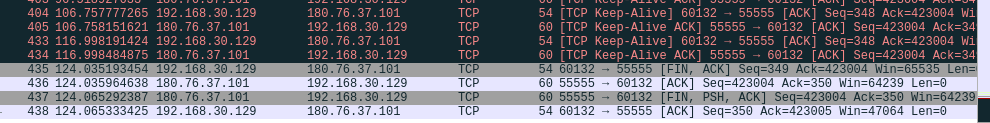  
&emsp; &emsp; 访问网页是长链接,因此会有tcp keep-alive.关闭网页后wireshark捕捉到四次分手过程.  
## 3 原理
&emsp; &emsp; 这一节介绍webserver的原理.以获取一张图片为例,先看一下基本流程:  
&emsp; &emsp;(1) C向S发起请求  
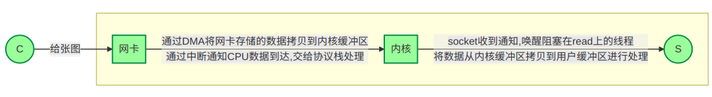
&emsp; &emsp;(2) S处理请求  
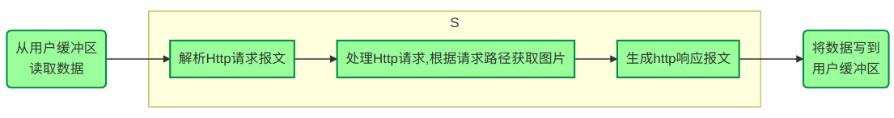
&emsp; &emsp;(3) S将图片发送给C  
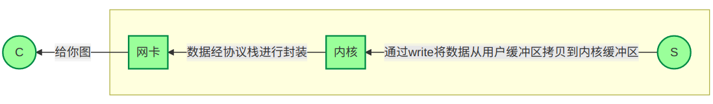
&emsp; &emsp; 接下来看看并发量升高时会有什么问题:  
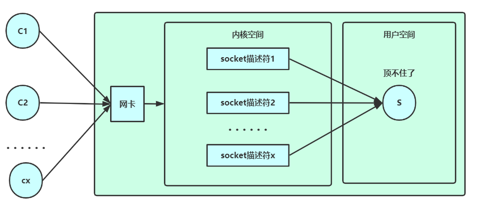  
&emsp; &emsp; 假设有10w个长连接,S要为每个sokcet描述符分配一个线程,总共10w个线程.每个线程都会占用一定的系统资源.在并发量较高的场景下系统资源很容易被耗尽.  
&emsp; &emsp; 怎么办呢?我们可以雇一个"管理员",负责通知我们哪些socket描述符可读/可写,这样只需要维护一个管理员线程就好.这里所说的管理员其实就是epoll.epoll原理推荐看 [参考资料[7]](https://zhuanlan.zhihu.com/p/115220699) .  
&emsp; &emsp; 有了epoll后S就轻松多了:  
&emsp; &emsp; (1) 接收请求报文:
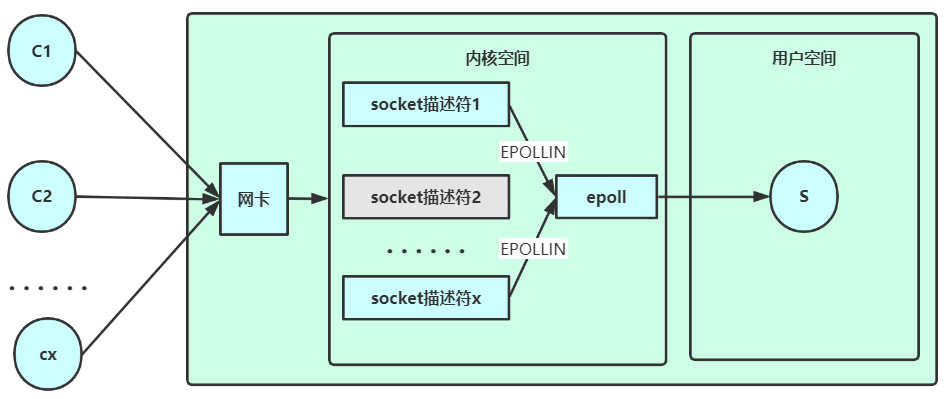  
&emsp; &emsp; (2) 回复响应报文:  
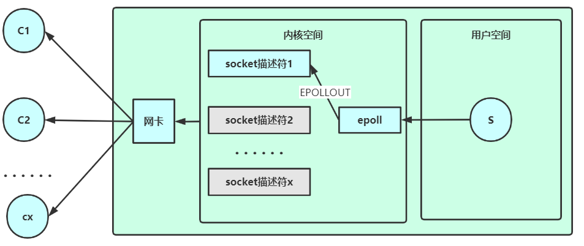  
&emsp; &emsp; 有了epoll,我们可以只用一个线程方便地管理大量连接.接下来只需要用线程池处理请求即可.  
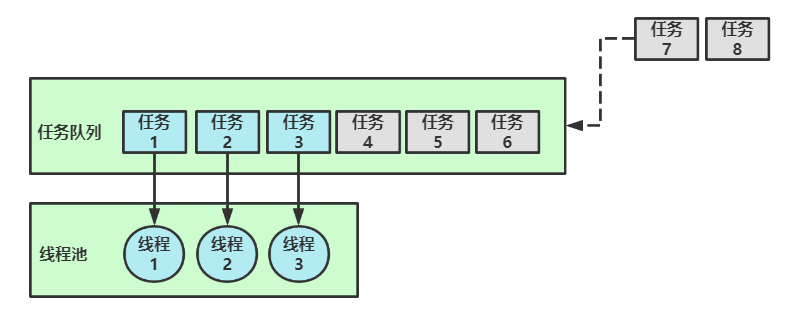  
&emsp; &emsp; 讨论:线程池容量不一定要严格等于处理器核心数.可以设为核心数+2防止有线程意外宕掉.如果处理任务要和磁盘打交道的话可以设得更多(这样可以使得部分线程在cpu执行时,另一部分线程能够通过DMA与磁盘打交道,提高cpu利用率).这些都取决于实际场景.  
&emsp; &emsp; 上述框架中,epoll负责收发数据,线程池负责处理数据.这个框架大家习惯叫半同步半反应堆.半同步是指epoll,因为epoll本质上是阻塞的,属于同步IO(windows下的IOCP才是真正的异步IO).半反应堆是指线程池,用于并行处理请求.  
## 4 实现
&emsp; &emsp; 接下来开始实现.先来想一下我们要做哪些工作.既然是半同步半反应堆,那么需要一个epoll模块和一个线程池模块.由于涉及内核空间和用户空间的数据交互,需要设计一个buffer模块.因为我们是用的http协议进行通信,需要设计一个http模块进行请求报文的解析和响应报文的制作.最后需要设计一个webserver模块去统筹调度上述模块.  
&emsp; &emsp; 出于上述考虑,项目结构如下. 
```
  bin
  doc
  include
   |   transmission
   |   |   webserver
   |   |   |   Http.h
   |   |   |   WebServer.h
   |   utils
   |   |   buffer
   |   |   |   Buffer.h
   |   |   concurrence
   |   |   |   ThreadPool.h`
   |   |   nio
   |   |   |   Epoll.h
   |   |   Error.h
  src
  test
  tools
  www
```
&emsp; &emsp; 除了上述模块外,Error模块用做异常处理,bin目录用于存放可执行程序,doc目录用于存放文档,include目录存放头文件,src目录存放源文件,test目录存放测试文件,tools目录存放一些工具,如代码行数统计,压力测试等.www目录存放网页用到的静态资源文件.  
### 4.1 Epoll  
&emsp; &emsp; 有关epoll的函数原型以及底层设计推荐看 [参考资料[8]](https://blog.csdn.net/baidu_41388533/article/details/110134366)  
&emsp; &emsp; 这个模块就是把epoll做了简单封装,方便调用,这理解不详细介绍了.  
### 4.2 线程池  
&emsp; &emsp; 有关线程池的设计细节推荐看 [参考资料[9]](https://www.cnblogs.com/lzpong/p/6397997.html)  
&emsp; &emsp; 基本原理是维护一个任务队列queue\<task\>和一个线程池vector\<thread\> .每个线程都是一个无限循环,当任务队列为空时wait,不为空时取一个任务执行.每添加一个新任务都会调用notify_one尝试唤醒一个线程.设计细节可以参考项目源码.  
### 4.3 Buffer  
&emsp; &emsp; 有关缓冲区的设计细节推荐看 [参考资料[10]](https://blog.csdn.net/daaikuaichuan/article/details/88814044)  
&emsp; &emsp; 为什么需要缓冲区, 来一条请求处理一条不好吗?回想第2节的抓包实验,一条http报文可能会被分为若干tcp分组发送,也就是说EPOLLIN来的数据可能有好几条请求连在一起,甚至可能只有一半请求.只有一半请求的话我们是无法处理的,需要借助缓冲区进行存储,待请求完整时才能继续处理.  
&emsp; &emsp; 这里参考muduo的设计.拿vector做缓冲区.设置m_readPos和m_writePos两个指针,[0, m_readPos)的数据已从缓冲区读出,[m_readPos, m_writePos)的数据已写入缓冲区,还未读,[m_writePos, buffer size)这段空间是还能继续写入的空间.  
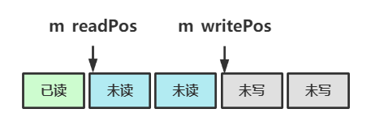  
&emsp; &emsp; 当缓冲区没有足够的空间写入时需要扩容.这里要分两种情况,一种情况是写入的数据总量超过了buffer大小,这时直接对buffer做resize操作就好,resize操作不会影响已写入的数据.另一种情况是写入的数据总量没有超过buffer大小,这时将[m_readPos, m_writePos)这段数据拷贝到缓冲区开头,即[0, m_writePos-m_readPos),并更新m_writePos = m_writePos-m_readPos, m_readPos = 0.这样做是为了尽可能避免缓冲区频繁扩容,造成空间浪费.  
&emsp; &emsp; 另外,当缓冲区的数据被一次性全部读出时,设置m_readPos = m_writePos = 0,同样也是为了节省空间.  
### 4.4 Http  
&emsp; &emsp; http模块的设计可以参考 [参考资料[4]](https://mp.weixin.qq.com/s/BfnNl-3jc_x5WPrWEJGdzQ) [参考资料[5]](https://mp.weixin.qq.com/s/wAQHU-QZiRt1VACMZZjNlw) [参考资料[6]](https://mp.weixin.qq.com/s/451xNaSFHxcxfKlPBV3OCg) 这三篇教程.  
&emsp; &emsp; http模块要做的事情主要是从输入缓冲区读请求报文,然后处理请求,包括获取相关文件以及调用用户自定义接口,最后将响应报文写到输出缓冲区.  
&emsp; &emsp; 首先实现请求报文的读取与响应报文的写入:  
```c++
    // 从readBuffer中读取请求
    // ET模式下WebServer会循环调用这个函数
    ssize_t Http::readRequest(int fd, int *ern) {
        char buffer[65536]; // 内核缓冲区比readBuffer剩余空间大时先存到这里,然后再对buffer进行扩容
        struct iovec iov[2];
        size_t wtb = m_readBuffer.writableBytes();
        iov[0].iov_base = m_readBuffer.nextWritePos();
        iov[0].iov_len = wtb;
        iov[1].iov_base = buffer;
        iov[1].iov_len = sizeof(buffer);
        ssize_t len = readv(fd, iov, 2); // 等于0貌似是对端关闭连接来着,在WebServer里也要断开连接
        if (len < 0) {
            *ern = errno;
        } else if (len > 0) {
            // 这里有的直接改buffer,有的只改下标,不太好看,不过为了效率就这么写吧...
            if (static_cast<size_t>(len) <= wtb) {
                m_readBuffer.writeBuffer_idx(static_cast<size_t>(len));
            } else {
                m_readBuffer.writeBuffer_idx(static_cast<size_t>(wtb));
                m_readBuffer.writeBuffer(buffer, len-wtb);
            }
            if (m_debug) {
                std::cout << "[fd:" << m_fd << "] ";
                m_readBuffer.output();
            }
        }
        return len;
    }

    // 将响应报文写入writeBuffer
    // ET模式下WebServer会循环调用这个函数
    ssize_t Http::writeResponse(int fd, int *ern) {
        ssize_t len = writev(fd, m_iov, m_iovCnt); // 这个等于0没什么影响,一般就是内核缓冲区写不进去了
        if (len < 0) {
            *ern = errno;
        }
        else if (len > 0) {
            if (static_cast<size_t>(len) > m_iov[0].iov_len) {
                m_iov[1].iov_base = (char*)m_iov[1].iov_base+(len-m_iov[0].iov_len);
                m_iov[1].iov_len -= (len - m_iov[0].iov_len);
                if (m_iov[0].iov_len != 0) {
                    m_writeBuffer.readBufferAll_idx(); // 相当于清空writeBuffer
                    m_iov[0].iov_len = 0;
                }
            } else {
                m_iov[0].iov_base = (char*)m_iov[0].iov_base+len;
                m_iov[0].iov_len -= len;
                m_writeBuffer.readBuffer_idx(len);
            }
        }
        return len;
    }
```
&emsp; &emsp; 可以看到代码在读写时都用到了io向量,也就是readv和writev函数.io向量可以帮助我们在一次系统调用内实现整个向量的读/写,否则的话要为向量中的每个元素做一次系统调用,影响效率.  
&emsp; &emsp; 读请求报文的时候用到了一个大小为65536的栈空间,如果读取的内容超过m_readBuffer的大小会将超出的部分暂存在这个栈空间中,然后给m_readBuffer扩容,再将栈空间的数据写入m_readBuffer,从而在每次读取时多读一些数据,减少系统调用的次数.  
&emsp; &emsp; 写响应报文的时候也用到了包含两个元素的io向量.这两个元素分别表示响应报文的状态行+头部以及响应内容.  
&emsp; &emsp; 接下来进行请求的处理,包括解析请求报文,获取请求文件/调用用户自定义接口以及生成响应报文.下述内容需要读者对http请求报文, 响应报文格式以及状态码的含义有一个基本的认识, 不了解的可以参考 [参考资料[4]](https://mp.weixin.qq.com/s/BfnNl-3jc_x5WPrWEJGdzQ) .  
&emsp; &emsp; 正如之前说的,m_readBuffer中的http请求可能不完整,也可能有若干条,解析起来比较困难.这里用一个状态机去做这件事情.可以简单的理解为一个while循环,每次处理请求中的一行数据.循环里面用一个switch判断当前的状态,并交给相应的方法去处理,直到从m_readBuffer中解析出一条请求.之后状态机会执行请求,并制作响应报文,存储在m_writeBuffer中.状体机是http模块的核心,其结构框图如下:  
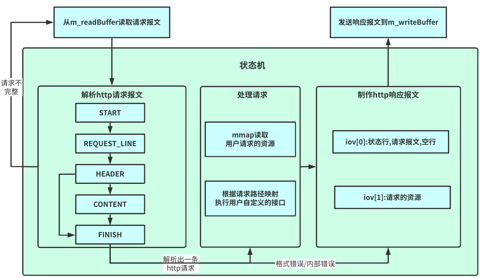  
&emsp; &emsp; 下面结合代码解释每个部分的作用.
```c++
    // 处理用户的请求(调用api或读取文件)
    // true表示之后可以发送响应报文了(有错误的话code会相应地设为BAD_REQUEST,INTERNAL_ERROR等),false表示数据不完整,还需要继续等待数据到来
    // userFunction是用户自定义的api
    bool Http::process(std::unordered_map<std::string, std::function<void(Http*)>> *userFunction) {
        // 注意缓冲区里的请求可能不完整,也可能有多条请求,这些都要考虑在内
        // 请求不完整时return false继续等数据就好,维护好状态机的全局状态
        // 多条请求时要在response发完后重新调用process,形成一个环路
        while (true) {
            if (m_state == START) {
                if (!readLine()) {
                    return false;
                }
                m_state = REQUEST_LINE;
            } else if (m_state == REQUEST_LINE) {
                if (!parseRequestLine()) {
                    m_code = BAD_REQUEST;
                    break;
                }
                m_state = HEADER;
                if (!readLine()) {
                    return false;
                }
            } else if (m_state == HEADER) {
                if (m_line.empty()) { // header后一定有个空行,接着根据是否有content进行状态转移
                    if (getContentLength() == 0) {
                        m_state = FINISH;
                    } else {
                        m_state = CONTENT;
                        if (!readLine()) {
                            return false;
                        }
                    }
                    continue;
                }
                if (!parseHeader()) {
                    m_code = BAD_REQUEST;
                    break;
                }
                if (!readLine()) {
                    return false;
                }
            } else if (m_state == CONTENT) {
                // todo
                utils::Error::Throw(utils::Error::SORRY);
            } else if (m_state == FINISH) {
                if (m_debug) {
                    std::cout << "[fd:" << m_fd << "] " << "finished" << std::endl;
                }
                break;
            } else {
                m_code = INTERNAL_ERROR;
                break;
            }
        }
        if (m_code == OK) {
            execute(userFunction); // 处理请求
        }
        // 制作响应报文
        addStateLine();
        addHeader();
        addContent();
        return true;
    }
```
&emsp; &emsp; 尽管目前没有实现POST请求的解析,但考虑到content不以\r\n结尾,我没有选择在每次循环开始时调用readLine读取m_readBuffer中的一行数据,而是在每个状态处理完毕后判断是否需要继续readLine.接着依据当前的状态(START, REQUEST_LINE, HEADER, CONTENT, FINISH)调用相应的函数(parseRequestLine,parseHeader以及parseContent),并进行状态转移.HEADER转移时要注意判断Content-Length是否为0(不存在的话也视为0),等于0的话就没必要去解析content了.  
&emsp; &emsp; 解析过程中如果readLine返回false则说明请求不完整,状态机向上层返回false表示继续等待数据到达.一次解析过程中状态m_state是持久化的,就是说如果当前解析到了HEADER,发现请求不完整返回false,那么下一次数据到达时状态机依然从HEADER状态进行解析.  
&emsp; &emsp; 解析出一条报文后,若未出现请求格式错误或内部错误则调用execute执行请求. 执行时会先判断请求路径是否与用户自定义的接口相关联(参数userFunction保存了请求路径到用户接口的映射,比如用户写了个helloworld函数,关联到了地址/hello上,那么userFunction这个map中就会保存一条<"/hello", helloworld()>),若无接口关联则尝试获取请求路径对应的文件.若文件存在,且有访问权限,则使用mmap读取文件到m_file中.mmap使得磁盘到用户内存只需要一次拷贝(正常需要磁盘到页缓存再到用户内存两次拷贝).相关原理可以查阅 [参考资料11](https://www.cnblogs.com/huxiao-tee/p/4660352.html) .具体实现如下:   
```c++
    // 其实用户api从WebServer那里传参过来也不怎么优雅...
    void Http::execute(std::unordered_map<std::string, std::function<void(Http*)>> *userFunction) {
        if (userFunction->count(m_path) == 1) {
            // 根据路径调用用户api
            if (m_debug) {
                std::cout << "[fd:" << m_fd << "] " << "call user function" << std::endl;
            }
            auto func = (*userFunction)[m_path];
            func(this);
        } else {
            // 使用mmap将文件映射到m_file
            if (m_debug) {
                std::cout << "[fd:" << m_fd << "] " << "read file" << std::endl;
            }
            std::string path = "../www"+m_path; // 我是默认在bin下面运行的,这个路径可以自己改一下
            if (stat(path.c_str(), &m_fileStat) < 0 || S_ISDIR(m_fileStat.st_mode)) {
                if (m_debug) {
                    std::cout << "[fd:" << m_fd << "] " << "not found1" << std::endl;
                }
                m_code = NOT_FOUND;
                return;
            }
            if (!(m_fileStat.st_mode & S_IROTH)) { // 权限判断
                if (m_debug) {
                    std::cout << "[fd:" << m_fd << "] " << "forbidden" << std::endl;
                }
                m_code = FORBIDDEN;
                return;
            }
            int fd = open(path.c_str(), O_RDONLY);
            if (fd < 0) {
                if (m_debug) {
                    std::cout << "[fd:" << m_fd << "] " << "not found2" << std::endl;
                }
                m_code = NOT_FOUND;
                return;
            }
            int* ret = (int*) mmap(nullptr, m_fileStat.st_size, PROT_READ, MAP_PRIVATE, fd, 0);
            if (*ret == -1) {
                if (m_debug) {
                    std::cout << "[fd:" << m_fd << "] " << "not found3" << std::endl;
                }
                m_code = NOT_FOUND;
                return;
            }
            m_file = (char*)ret;
            close(fd);
            if (m_debug) {
                std::cout << "[fd:" << m_fd << "] " << "read successfully" << std::endl;
            }
        }
    }
```
&emsp; &emsp; 若出现了错误则生成响应报文告诉用户请求出错,随后断开连接释放所有资源.最后,状态机会依次调用addStateLine,addHeader,addContent制作请求报文保存到m_writeBuffer中,整个Http模块就完成了一次任务.  
&emsp; &emsp; 上述过程用到了readLine, parseRequestLine, parseHeader以及parseContent, execute, addStateLine, addHeader, addContent等函数.execute函数已经介绍过了, 其余函数涉及一些字符串的查询和正则表达式匹配,可以自行查阅源码.  
&emsp; &emsp; 至此http模块完工.回顾一下,我们用io向量读写缓冲区;用状态机从m_readBuffer中解析请求报文,处理请求(根据请求路径调用用户接口/用mmap读取请求文件),并生成响应报文到m_writeBuffer中.不过目前整个项目还无法运作,我们还未将各个模块整合到一起.最后的统筹调度工作交给webserver模块完成.  
### 4.5 webserver  
&emsp; &emsp; 如下面的代码所示,webserver本质上也是个状态机.没有IO事件触发时epoll会阻塞在wait上.当事件触发时,若当前事件的描述符与epoll的描述符相同,则说明要建立新的连接,webserver会调用addUser去accept这个连接,在epoll中为accept到的描述符注册一个新事件,并创建一个http对象负责处理这个连接的请求.当EPOLLIN事件到来时webserver会调用processRead将内核缓冲区的请求报文拷贝到相关http对象的读缓冲区,处理请求,这个过程会创建一个任务,交给线程池去执行.EPOLLOUT事件到来时表示内核缓冲区可写,webserver会调用processWrite将相关http对象写缓冲区的响应报文写入内核缓冲区,这个过程同样也会创建一个任务,交给线程池去处理.EPOLLRDHUP|EPOLLHUP|EPOLLERR表示对端关闭或者出错,此时调用delUser关闭连接,在epoll中删除相应的事件,并删除对应的http对象.  
```c++
    void WebServer::start() {
        // 由于设置了oneshot每个fd只会被一个线程处理,因此每个事件内部是无数据竞争的
        // 但不同事件间可能有数据竞争,这个在delUser里作了处理(分析一下会发现就delUser会有问题,其余函数都是线程安全的)
        while (!isClosed) {
            if (m_debug) {
                std::cout << "========================================" << std::endl;
            }
            // blocking
            int eventCnt = m_epoll.wait(-1);
            // process events
            for (int i = 0; i < eventCnt; i++) {
                int fd = m_epoll.getFd(i);
                uint32_t events = m_epoll.getEvent(i);
                if (fd == m_fd) {
                    addUser();
                } else if (events & (EPOLLRDHUP|EPOLLHUP|EPOLLERR)) {
                    delUser(fd);
                } else if (events & EPOLLIN) {
                    processRead(fd);
                } else if (events & EPOLLOUT) {
                    processWrite(fd);
                } else {
                    utils::Error::Throw(utils::Error::EPOLL_UNEXPECTED_ERROR);
                }
            }
        }
    }
```
&emsp; &emsp; addUser,delUser,processRead,processWrite等函数的实现如下:  
&emsp; &emsp; (1) processRead & processWrite:
```c++
    void WebServer::processRead(int fd) {
        assert(m_users.count(fd) > 0);
        Http* user = m_users[fd];
        assert(user != nullptr);
        if (m_debug) {
            std::cout << "epoll in" << std::endl;
        }
        m_threadPool.addTask([this, fd, user] {
            // read request
            while (true) {
                int ern = 0;
                ssize_t ret = user->readRequest(fd, &ern);
                if (ret < 0) {
                    if (ern == EAGAIN || ern == EWOULDBLOCK) {
                        break;
                    }
                    if (m_debug) {
                        std::cout << "processRead:ret < 0:delete user" << std::endl;
                    }
                    delUser(fd);
                    return;
                } else if (ret == 0) {
                    if (m_debug) {
                        std::cout << "processRead:ret == 0:delete user" << std::endl;
                    }
                    delUser(fd);
                    return;
                }
            }
            // 处理请求
            if (user->process(&userFunction)) {
                // 注意由于设置了oneshot这里要更新一下才能继续使用这个fd
                m_epoll.modFd(fd, m_userEvent | EPOLLOUT);
            } else {
                // 请求不完整,继续等待数据
                m_epoll.modFd(fd, m_userEvent | EPOLLIN);
            }
        });
    }

    void WebServer::processWrite(int fd) {
        assert(m_users.count(fd) > 0);
        Http* user = m_users[fd];
        assert(user != nullptr);
        if (m_debug) {
            std::cout << "epoll out" << std::endl;
        }
        m_threadPool.addTask([this, fd, user] {
            while (true) {
                int ern = 0;
                ssize_t ret = user->writeResponse(fd, &ern);
                if (ret < 0) {
                    if (ern == EAGAIN || ern == EWOULDBLOCK) {
                        break;
                    }
                    if (m_debug) {
                        std::cout << "processWrite:ret < 0:delete user" << std::endl;
                    }
                    delUser(fd);
                } else if (ret == 0) {
                    break;
                }
            }
            if (user->toWriteBytes() == 0) {
                // buffer dirty
                if (user->hasError()) {
                    if (m_debug) {
                        std::cout << "processWrite:has error:delete user" << std::endl;
                    }
                    delUser(fd);
                    return;
                }
                // 短连接时server会在发送完响应报文后关闭连接
                if (!user->isKeepAlive()) {
                    if (m_debug) {
                        std::cout << "processWrite:keep alive:delete user" << std::endl;
                    }
                    delUser(fd);
                    return;
                }
                // 如process中描述的那样, 多条请求时要在response发完后重新调用process,形成一个环路
                user->initNextHttp();
                if (user->process(&userFunction)) {
                    m_epoll.modFd(fd, m_userEvent | EPOLLOUT);
                } else {
                    m_epoll.modFd(fd, m_userEvent | EPOLLIN);
                }
            } else {
                m_epoll.modFd(fd, m_userEvent | EPOLLOUT);
            }
        });
    }
```
&emsp; &emsp; 这里涉及到了与Http模块缓冲区的交互,也是之前遗留下来的一个问题.我们先来了解一下LT(水平触发)模式和ET(边缘触发)模式.LT模式下只要内核缓冲区不为空/不满就持续触发EPOLLIN/EPOLLOUT去通知用户读取/写入,而ET模式下只有缓冲区从空到非空/从满到非满时才会触发一次EPOLLIN/EPOLLOUT去通知用户读取/写入.换言之,LT模式下一次EPOLLIN/EPOLLOUT可以只进行一次read/wirte,这次没有读/写完的话epoll还会继续通知.但在ET模式下不能这样做.假设客户只发了一条请求,服务器完整接受并保存在了内核缓冲区.由于用户缓冲区大小的限制,只有一半请求从内核拷贝到了用户.在这个场景下客户后续不再发送请求,不会再触发EPOLLIN,也就是说另一半请求会一直留在内核缓冲区中读不出来.ET模式需要我们在一次EPOLLIN时循环读取内核数据,直到errorno == EAGAIN, 表示内核缓冲区中已无数据(写的时候一般没什么问题,不过为了效率也采用循环写比较好).另外,ET模式通常是比LT模式高效的,项目也是采用了ET模式.  
&emsp; &emsp; 还有一个很重要的问题,由于此处涉及到了并发,需警惕并发漏洞.庆幸的是,epoll的EPOLLONESHOT选项帮助我们简化了这个问题.设置EPOLLONESHOT后一个事件只会被触发一次,也就是说它触发后只能被一个线程处理(不设置EPOLLONESHOT的话可能会有多个线程同时修改一个Http对象).这样可以保证一个事件不会和自己产生数据竞争.注意要在线程处理结束后重新设置这个事件,不然会影响后续的正常使用.  
&emsp; &emsp; 另外,在processWrite中还有一些关键设置.一是在发送完响应报文后立即初始化并执行状态机.这样是为了处理上面提到的m_readBuffer中有多条请求的情况.现在整个过程形成了一个闭环,保证所有请求都能得到处理.二是我特别处理了一下请求出错的情况,在发送完响应报文后会关闭连接,保护服务器.关于发送完报文再关闭连接这个操作可以去设置socket的linger,里面可以选择正常FIN,RST或是定时FIN+RST,我用了定时(1s)FIN+RST,毕竟关闭连接时也不想让服务器等太长时间.  
&emsp; &emsp; (2) addUser & delUser:
```c++
    void WebServer::addUser() {
        struct sockaddr_in address = {};
        socklen_t len = sizeof(address);
        while (true) {
            int fd = accept(m_fd, (struct sockaddr*)&address, &len);
            // 举个例子,fd=4被close以后下次accept的fd可能还是4,也就是说一个序号会被重复利用
            // 因此我没有delete掉Http,而是每次重新初始化,这样空间会耗费一些,但就不用每次都new了,会快一点
            if (fd < 0 || m_userCnt >= MAX_USER) {
                return;
            }
            setNonBlocking(fd);
            if (m_users.count(fd) == 0) {
                m_users[fd] = new Http(fd, m_debug);
            } else {
                Http* user = m_users[fd];
                user->clearBuffer();
                user->initNextHttp();
            }
            m_userCnt++;
            m_epoll.addFd(fd, m_userEvent | EPOLLIN);
            if (m_debug) {
                std::cout << "add user, fd = " << fd << std::endl;
                std::cout << "userCnt = " << m_userCnt << std::endl;
            }
        }
    }

     void WebServer::delUser(int fd) {
        assert(m_users.count(fd) > 0);
        assert(m_users[fd] != nullptr);
        // 由于多个任务可能并发调用delUser,这里会发生数据竞争,所以用了原子变量
        m_userCnt--;
        m_epoll.delFd(fd);
        close(fd);
        if (m_debug) {
            std::cout << "delete user, fd = " << fd << std::endl;
            std::cout << "userCnt = " << m_userCnt << std::endl;
        }
    }
```
&emsp; &emsp; epoll需要为套接字设置非阻塞模式,addUser中的while(true) accept就是最好的例子.观察一下会发现这个死循环只有当accept接受不到新连接时才会跳出,而在阻塞模式下accept接受不到新连接的话会阻塞,会永远卡死在这个地方.同理ET模式的while循环中也会有这个问题.所以我们把所有套接字都设置成了非阻塞模式.  
&emsp; &emsp; 另外,被释放的套接字编号是可以再次被accept利用的,这时我并没有重新new一个Http对象,而是选择了直接初始化(清空缓冲区+初始化状机).  
&emsp; &emsp; addUser, delUser中的m_userCnt可能会被多个线程同时更新,因此要使用原子变量避免数据竞争.由于我们并没有去delete Http对象,因此无需担心m_users的数据竞争.epoll自身是线程安全的,也不需要我们担心.  
&emsp; &emsp; 至此,项目构建完毕!整体框图如下:  
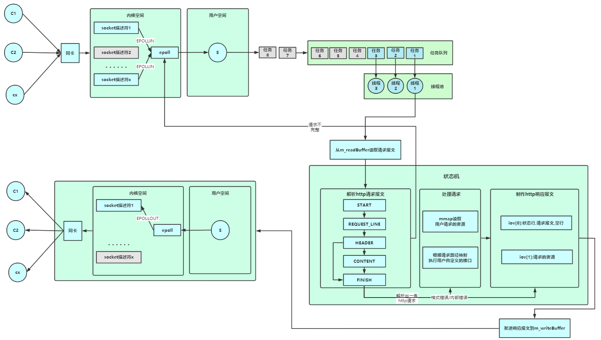
## 5 压测&对比  
&emsp; &emsp; 这一节我会用webbence1.5对本文的WebServer(SimpleWebServer), [参考资料[2]](https://github.com/markparticle/WebServer) 的WebServer(先叫它MPWebServer)以及gin做压测对比,向它们请求同一张图片(40KB).环境是deepin20+AMD R7 4800U+16GB,SimpleWebServer和MPWebServer均开启O3优化.因为没有合适的设备,压测程序和WebServer都放在了本机上.创建100个连接压测5秒  
&emsp; &emsp; (1) SimpleWebserver,11400QPS:  
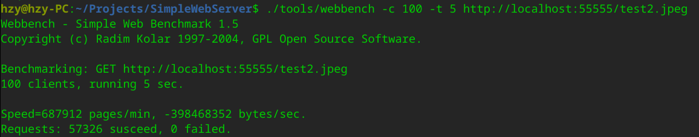  
&emsp; &emsp; (2) MPWebserver,10400QPS:  
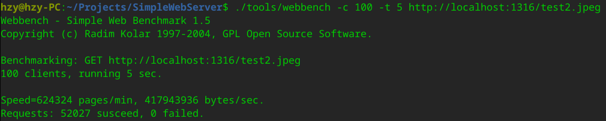  
&emsp; &emsp; (3) gin,21100QPS:  
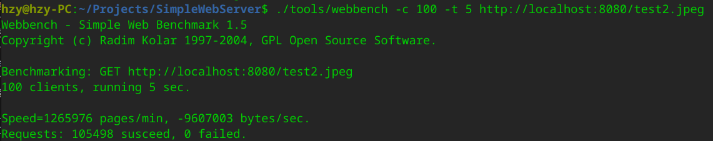  
&emsp; &emsp; 差不多是我的两倍,不清楚是不是协程带来的优化,总之后面还会研究一下.  
## 参考资料  
[1] https://github.com/qinguoyi/TinyWebServer  
[2] https://github.com/markparticle/WebServer  
[3] Linux高性能服务器编程，游双著  
[4] http连接处理(上): https://mp.weixin.qq.com/s/BfnNl-3jc_x5WPrWEJGdzQ  
[5] http连接处理(中): https://mp.weixin.qq.com/s/wAQHU-QZiRt1VACMZZjNlw  
[6] http连接处理(下): https://mp.weixin.qq.com/s/451xNaSFHxcxfKlPBV3OCg  
[7] IO多路复用: https://zhuanlan.zhihu.com/p/115220699  
[8] Epoll: https://blog.csdn.net/baidu_41388533/article/details/110134366  
[9] 线程池: https://www.cnblogs.com/lzpong/p/6397997.html  
[10] buffer设计: https://blog.csdn.net/daaikuaichuan/article/details/88814044  
[11] mmap:https://www.cnblogs.com/huxiao-tee/p/4660352.html
