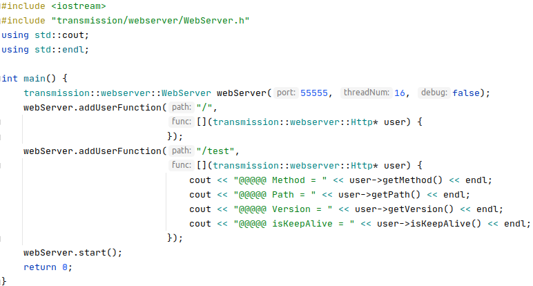
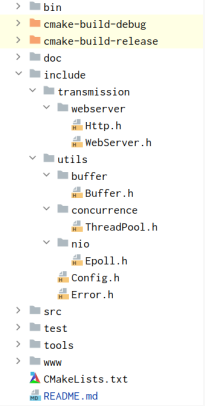
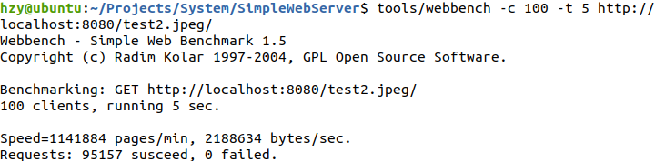

# 用C++实现一个简易的Webserver  
&emsp; &emsp; 最近出于个人兴趣用c++写了个webserver.用到了Epoll多路复用+线程池,实现了半同步半反应堆模型,支持ET模式.用buffer+状态机的方式实现了http/1.1请求报文的解析(目前只支持GET),使用mmap将文件映射到内存并生成响应报文.想和大家交流一下学到的技术.我会尽量说清楚每个函数的作用以及为什么要这么做.很多内容都是出于个人理解,如果有错误欢迎在评论区留言指正.如果有什么好的改进方案也欢迎在评论区留言.  
&emsp; &emsp; [项目地址,感觉有帮助的话还请给个star.](https://github.com/Zongyin-Hao/SimpleWebServer)  
## 1 编译&运行  
&emsp; &emsp; github上的项目是编译好的,二进制文件在bin目录下,运行时cd到bin目录执行./SimpleWebServer即可(注意由于路径问题一定要在bin目录下运行).默认端口55555.  
```
  cd bin
  ./SimpleWebServer
```
&emsp; &emsp; 如果想自己编译的话可以将项目导入clion进行编译(导入前删掉.idea, 使用release模式).或者在项目目录下新建个build文件夹,cd进去使用cmake -DCMAKE_BUILD_TYPE=Release ..以及make进行编译(编译后的二进制文件在bin目录下).  
```
  mkdir build
  cd build
  cmake -DCMAKE_BUILD_TYPE=Release ..
  make
```
&emsp; &emsp; 如果想自定义端口,自定义api的话需要去src/main.cpp里进行修改,然后重新编译:
  
## 2 功能展示  
### 2.1 获取图片  
  
### 2.2 大文件下载  
  
&emsp; &emsp; 下载好的视频是可以正常播放的,大家可以自行测试.  
### 2.3 API调用  
&emsp; &emsp; 支持根据请求路径调用用户自定义的API.  
  
### 2.4 抓包分析  
&emsp; &emsp; 以获取图片为例做简单的wireshark抓包分析(为了方便演示我把项目部署到了云服务器)  
  
&emsp; &emsp; 建立连接, 三次握手:  
  
&emsp; &emsp; 注意浏览器可能还会发送一个favicon.ico的请求,因此可能有两次连接建立.图中60132端口的请求才是我们的请求.ack number总是等于seq number+1,可以自己验证.  
&emsp; &emsp; 获取图片:  
  
&emsp; &emsp; ack number表示期望对方下一次传输的seq number.可以看到tcp无法判断数据流的边界,也就是说http报文可能会被切分成多份,也可能多个报文同时到达.我们在处理时必须考虑这些情况.  
&emsp; &emsp; 关闭连接, 四次分手:  
  
&emsp; &emsp; 访问网页是长链接,因此会有tcp keep-alive.关闭网页后wireshark捕捉到四次分手过程.  
## 3 原理&实现  
&emsp; &emsp; 这一节我会先结合原理描述webserver的完整流程,接着分享我的实现细节,包括项目结构,各模块功能,以及为什么这样设计等;  
&emsp; &emsp;以获取一张图片为例,先看一下基本的流程:  
&emsp; &emsp;(1) C向S发起请求  

&emsp; &emsp;注:缓冲区分发送缓冲区和接收缓冲区,这里为了方便我们统称为缓冲区  
&emsp; &emsp;(2) S处理请求  

&emsp; &emsp;(3) S将图片发送给C  

&emsp; &emsp;注: 数据从内核到网卡的具体流程我没有查到,是否是这样: 内核缓冲区中的数据通过DMA发送到网卡,网卡发送完数据后中断通知CPU可以继续发送数据?有了解的朋友可以在评论区指导一下.  
&emsp; &emsp; OK,现在我们了解了通信的大体流程,接下来看看并发量升高时会有什么问题:  
  
&emsp; &emsp; 假设有10w个长连接,S要为每个sokcet描述符分配一个线程,总共10w个线程.每个线程都会占用一定的系统资源(最小8KB内核栈,本文不讨论协程).在并发量较高的场景下系统资源很容易被耗尽.  
&emsp; &emsp; 怎么办呢?我们可以雇一个管理员,哪些socket fd可读/可写由这个管理员告诉我们.这样我们只需要一个管理员线程就好.而epoll就是这个管理员.epoll原理推荐看 [参考资料[7]](https://zhuanlan.zhihu.com/p/115220699) , [参考资料[8]](https://blog.csdn.net/baidu_41388533/article/details/110134366) ,写得很好.  
&emsp; &emsp; 现在S的框架就变成了这个样子:  
&emsp; &emsp; 接收请求报文:
  
&emsp; &emsp; 回复响应报文:  
  
&emsp; &emsp; 注意我们讨论的是长连接的情况,短连接时给每个socket描述符都分一个线程就好.  
&emsp; &emsp; 有了epoll,我们可以只用一个线程方便地把数据从内核缓冲区拷贝到用户缓冲区.然而,为提升处理效率,我们应充分发挥多核处理器的优势,进行并行处理.那就为每个请求创建一个处理线程...等一下,这样10w个请求不又会有10w个处理线程吗?我们限制线程的最大数目为处理器核心数,这里的线程只是做并行处理用的,而非收发数据.我们也很自然地想到用线程池去做这件事情.  
&emsp; &emsp; 其实线程池容量不一定要严格等于处理器核心数.可以设为核心数+2防止有线程意外宕掉.如果处理任务要和磁盘打交道的话可以设得更多,以便充分发挥DMA的优势.这些都取决于实际场景.  
&emsp; &emsp; 讨论了这么多,我们的框架终于确定下来了.epoll负责收发数据,线程池负责处理数据.这个框架大家习惯叫半同步半异步,或者半同步半反应堆.半同步是指epoll,因为epoll本质上还是阻塞的,属于同步IO(windows下的IOCP才是真正的异步IO).半异步/反应堆是指线程池,还是比较好理解的.  
&emsp; &emsp; 原理就到这里,接下来开始实现,有些细节只有实现一次才会理解.先来想一下我们要做哪些工作.既然是半同步半反应堆,那么得有个epoll模块和线程池模块.网卡和内核那块不归我们管,但内核空间和用户空间的数据交互需要我们实现,这就需要一个buffer模块.因为我们是用的http(v1.1)协议进行通信,要进行请求报文的解析和响应报文的制作,以及文件的读取(以及用户api的调用),状态码的处理等,这些我们统一放在http模块中,在http模块里维护一个状态机去做这些事情.最后我们需要设计一个WebServer模块去统筹调度上述模块,形成一个整体.  
&emsp; &emsp; 出于上述考虑,我的项目结构如下.可以看到项目包含了上述的WebServer模块,Http模块,Epoll模块,Buffer模块和ThreadPool模块.Error模块做异常处理,Config模块做配置(暂未使用).  
&emsp; &emsp; 此外,我的bin目录存放可执行程序,doc目录存放文档(其实是README用到的图片),include目录存放头文件,src目录存放源文件,test目录存放测试文件,tools目录存放一些工具,如代码行数统计,压测工具等.www目录存放网页用到的静态资源文件.  
  
&emsp; &emsp; (1) 线程池:  
&emsp; &emsp; 基本原理是维护一个任务队列和一个线程池,每个线程里面都有一个无限循环,当任务队列为空时wait,不为空时取一个任务执行.每新添加一个新任务都会调用notify_one尝试唤醒一个线程.原理比较好理解,实现时发现大部分时间都在和C++11的特性斗智斗勇,包括thread,mutex,condition_variable,atomic,functional以及lamda表达式.话说回来我在实现addTask函数时是想写个模板做完美转发的,但一直报错,无奈传个左值引用了事.  
&emsp; &emsp; (2) Epoll:  
&emsp; &emsp; 这个模块就是把epoll做了简单封装,方便调用.具体的应用我会在WebServer模块里做详细介绍.  
&emsp; &emsp; (3) Buffer:  
&emsp; &emsp; 这里参考muduo.拿vector做缓冲区.设置m_readPos和m_writePos两个指针,[0, m_readPos)的数据已从缓冲区读出,[m_readPos, m_writePos)的数据已写入,还未读,[m_writePos, buffer大小)这段空间是还能继续写入的空间.  
&emsp; &emsp; 当缓冲区没有足够的空间写入时需要扩容.这里要分两种情况,一种是要写入的数据总量超过了buffer大小,这时直接对buffer做resize操作就好,resize操作不会影响已写入的数据.另一种情况是要写入的数据总量没有超过buffer大小,这时我们将[m_readPos, m_writePos)这段数据拷贝到缓冲区开头,即[0, m_writePos-m_readPos),并更新m_writePos = m_writePos-m_readPos, m_readPos = 0.这样做是为了尽可能避免缓冲区频繁扩容,造成空间浪费.  
&emsp; &emsp; 另外,当缓冲区的数据被一次性全部读出时,我们设置m_readPos = m_writePos = 0,同样也是为了节省空间.  
&emsp; &emsp; muduo的缓冲区还规定了读写文件描述符的方式,这个我抽离到Http模块里了,因为写文件描述符时需要使用Http模块里的io向量,这个放到Buffer里总感觉有点奇怪.  
&emsp; &emsp; 有关缓冲区的设计细节推荐看 [参考资料[10]](https://blog.csdn.net/daaikuaichuan/article/details/88814044)  
&emsp; &emsp; (4) Http:  
&emsp; &emsp; 基础设施有了,现在要实现功能了.重头戏来了.首先我推荐 [参考资料[4]](https://mp.weixin.qq.com/s/BfnNl-3jc_x5WPrWEJGdzQ) [参考资料[5]](https://mp.weixin.qq.com/s/wAQHU-QZiRt1VACMZZjNlw) [参考资料[6]](https://mp.weixin.qq.com/s/451xNaSFHxcxfKlPBV3OCg) ,我在编写项目的过程中也是反复阅读这三篇资料中的源码,状态图,http报文结构,状态码.也查阅了各种函数的功能. 我尽量给大家理清楚. 
## 4 压测&对比  
&emsp; &emsp; 这一节我会用webbence1.5对本文的WebServer(SimpleWebServer), [参考资料[2]](https://github.com/markparticle/WebServer) 的WebServer(先叫它MPWebServer吧)以及gin做压测对比,向它们请求同一张图片(40KB).环境是ubuntu20.04(虚拟机)+AMD R7 4800U(给虚拟机分了4核)+12GB内存,SimpleWebServer和MPWebServer均开启O3优化.因为没有合适的设备,压测程序和WebServer都放在了本机上.创建100个连接压测5秒(我创1w个连接压测30s时ubuntu直接黑屏了,进程数还是少一点吧...)  
&emsp; &emsp; SimpleWebserver,6000QPS:  
  
&emsp; &emsp; MPWebserver,5000QPS:  
  
&emsp; &emsp; 话说MPWebServer自己测试时有1w+QPS,或许我升级一下机器也可以⊙▽⊙  
&emsp; &emsp; gin,19000QPS:  
  
&emsp; &emsp; 是我的三倍还多w(ﾟДﾟ)w,这是协程的魔力吗?看来自己还是得继续摸索.读者们有好的建议的话可以在评论区留言.  
&emsp; &emsp; 最后,我的1核2GB 1Mb带宽的服务器只有10QPS...(调一个空api的话有200左右,带宽太稀缺了)  

## 5 参考资料  
[1] https://github.com/qinguoyi/TinyWebServer  
[2] https://github.com/markparticle/WebServer  
[3] Linux高性能服务器编程，游双著  
[4] http连接处理(上): https://mp.weixin.qq.com/s/BfnNl-3jc_x5WPrWEJGdzQ  
[5] http连接处理(中): https://mp.weixin.qq.com/s/wAQHU-QZiRt1VACMZZjNlw  
[6] http连接处理(下): https://mp.weixin.qq.com/s/451xNaSFHxcxfKlPBV3OCg  
[7] IO多路复用: https://zhuanlan.zhihu.com/p/115220699
[8] Epoll: https://blog.csdn.net/baidu_41388533/article/details/110134366  
[9] 线程池: https://www.cnblogs.com/lzpong/p/6397997.html  
[10] buffer设计: https://blog.csdn.net/daaikuaichuan/article/details/88814044