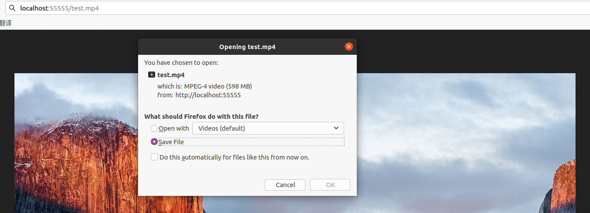

# 用C++实现一个简易的Webserver
&emsp; &emsp; 最近出于个人兴趣用c++写了个webserver.用到了Epoll多路复用+线程池,实现了半同步半反应堆模型,支持ET模式.用buffer+状态机的方式实现了http/1.1请求报文的解析(目前只支持GET),使用mmap将文件映射到内存并生成响应报文.想和大家交流一下学到的技术.我会尽量说清楚每个函数的作用以及为什么要这么做.很多内容都是出于个人理解,如果有错误欢迎在评论区留言指正.如果有什么好的改进方案也欢迎在评论区留言.  
&emsp; &emsp; [项目地址,感觉有帮助的话还请给个star.](https://github.com/Zongyin-Hao/SimpleWebServer)  
## 1 编译&运行  
&emsp; &emsp; github上的项目是编译好的,二进制文件在bin目录下,运行时cd到bin目录执行./SimpleWebServer即可(注意由于路径问题一定要在bin目录下运行).默认端口55555.  
```
  cd bin
  ./SimpleWebServer
```
&emsp; &emsp; 如果想自己编译的话可以将项目导入clion进行编译(导入前删掉.idea, 使用release模式).或者在项目目录下新建个build文件夹,cd进去使用cmake -DCMAKE_BUILD_TYPE=Release ..以及make进行编译(编译后的二进制文件在bin目录下).
```
  mkdir build
  cd build
  cmake -DCMAKE_BUILD_TYPE=Release ..
  make
```
&emsp; &emsp; 如果想自定义端口,自定义api的话需要去src/main.cpp里进行修改,然后重新编译:
  
## 2 功能展示
### 2.1 获取图片
  
### 2.2 大文件下载
  
&emsp; &emsp; 下载好的视频是可以正常播放的,大家可以自行测试.
### 2.3 API调用
&emsp; &emsp; 支持根据请求路径调用用户自定义的API.
  
### 2.4 抓包分析
&emsp; &emsp; 以获取图片为例做简单的wireshark抓包分析(为了方便演示我把项目部署到了云服务器)
  
&emsp; &emsp; 建立连接, 三次握手:
  
&emsp; &emsp; 注意浏览器可能还会发送一个favicon.ico的请求,因此可能有两次连接建立.图中60132端口的请求才是我们的请求.ack number总是等于seq number+1,可以自己验证.  
&emsp; &emsp; 获取图片:
  
&emsp; &emsp; ack number表示期望对方下一次传输的seq number.可以看到tcp无法判断数据流的边界,也就是说http报文可能会被切分成多份,也可能多个报文同时到达.我们在处理时必须考虑这些情况.  
&emsp; &emsp; 关闭连接, 四次分手:
  
&emsp; &emsp; 访问网页是长链接,因此会有tcp keep-alive.关闭网页后wireshark捕捉到四次分手过程.
## 3 原理&实现
&emsp; &emsp; 这一节我会先结合原理描述webserver的完整流程,接着分享我的实现细节,包括项目结构,各模块功能,以及为什么这样设计等.

## 4 压测&对比
&emsp; &emsp; 这一节我会用webbence1.5对本文的WebServer(SimpleWebServer),参考资料[2]的WebServer(先叫它MPWebServer吧)以及gin做压测对比,向它们请求同一张图片(40KB).环境是ubuntu20.04(虚拟机)+AMD R7 4800U(给虚拟机分了4核)+12GB内存,SimpleWebServer和MPWebServer均开启O3优化.因为没有合适的设备,压测程序和WebServer都放在了本机上.创建100个连接压测5秒(我创1w个连接压测30s时ubuntu直接黑屏了,进程数还是少一点吧...)  
&emsp; &emsp; SimpleWebserver,6000QPS:  
  
&emsp; &emsp; MPWebserver,5000QPS:  
  
话说MPWebServer自己测试时有1w+QPS,或许我升级一下机器也可以(๑•̀ㅂ•́)و✧
&emsp; &emsp; gin,19000QPS:
  
是我的三倍还多w(ﾟДﾟ)w,这是协程的魔力吗?看来自己还是得继续摸索.读者们有好的建议的话可以在评论区留言.
## 5 参考资料
[1] https://github.com/qinguoyi/TinyWebServer  
[2] https://github.com/markparticle/WebServer  
[3] Linux高性能服务器编程，游双著  
[4] https://huixxi.github.io/2020/06/02/%E5%B0%8F%E7%99%BD%E8%A7%86%E8%A7%92%EF%BC%9A%E4%B8%80%E6%96%87%E8%AF%BB%E6%87%82%E7%A4%BE%E9%95%BF%E7%9A%84TinyWebServer/#more  
[5] http连接处理(上):https://mp.weixin.qq.com/s/BfnNl-3jc_x5WPrWEJGdzQ  
[6] http连接处理(中):https://mp.weixin.qq.com/s/wAQHU-QZiRt1VACMZZjNlw  
[7] http连接处理(下):https://mp.weixin.qq.com/s/451xNaSFHxcxfKlPBV3OCg  
[8] Epoll:https://blog.csdn.net/baidu_41388533/article/details/110134366  
[9] 线程池:https://www.cnblogs.com/lzpong/p/6397997.html  
[10] buffer设计:https://blog.csdn.net/daaikuaichuan/article/details/88814044  